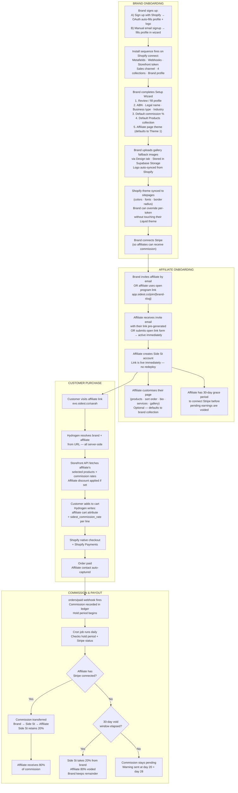
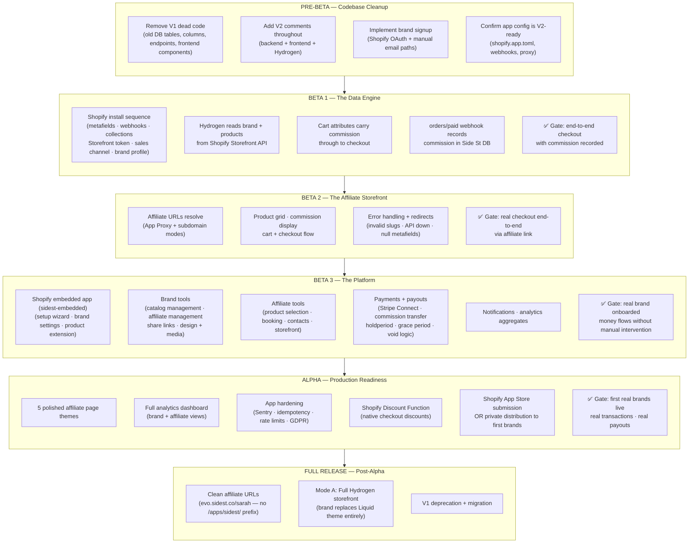

# Side St — V2 Platform Plan

## Overview

V2 gives each brand their own Hydrogen-powered affiliate storefront, deployed via Shopify Oxygen. Affiliates get a branded page at `evo.sidest.co/sarah` — the brand's subdomain on Side St's domain, with their Liquid storefront left completely untouched. The accounts dashboard stays on Vercel (Next.js). The backend stays on Laravel Cloud.

---

## Full Journey Map

End-to-end flow from brand signup to affiliate payout.



---

## Development Phases Overview

High-level view of the build stages for non-developer team members.



---

## Architecture

### Who's Involved
```
Side St (platform)
  └── Brands       — connect Shopify, manage affiliates, set commission %
        └── Affiliates  — get personal link on brand's domain, drive sales, earn commission
              └── Customers — shop on branded affiliate page, pay via Shopify Payments
```

> **Single-brand constraint:** Each affiliate belongs to exactly one brand. An affiliate's Hydrogen storefront is hosted on that brand's Oxygen deployment — they are scoped to that store and cannot be linked to multiple brands. All affiliate data (slug, product selections, earnings) is therefore brand-specific by definition.

### How Affiliate URLs Work

Each brand gets a subdomain on `sidest.co`. Hydrogen reads the subdomain to identify the brand, and the path to identify the affiliate.

```
evo.sidest.co/sarah     → sarah's affiliate page for evo
evo.sidest.co/john      → john's affiliate page for evo
evo.sidest.co/          → evo's brand storefront page

Brand's main site stays as Liquid, completely untouched:
evo.com                 → Liquid theme (Side St never touches this)
```

### Hosting
| Layer | What | Hosted On | Paid By |
|---|---|---|---|
| Affiliate storefronts | Hydrogen (per-brand deployment) | Oxygen (each brand's own store) | Free (Shopify covers Oxygen) |
| Shopify embedded app | React Router (Remix) app | Vercel (embedded.sidest.co) | Side St |
| Accounts dashboard | Next.js | Vercel (app.sidest.co) | Side St |
| API backend | Laravel | Laravel Cloud | Side St |
| Database | Postgres + RLS | Supabase | Side St |

---

## Repository Structure

Three repositories. Each owns a distinct surface. No feature lives in two repos.

### Repo 1 — `sidest-backend` (Laravel)
**Owns:** All business logic, data, auth, integrations.
- Supabase DB migrations and models
- All API endpoints consumed by both frontend repos
- Shopify OAuth install flow + webhook handlers
- Stripe Connect + payout logic
- Square bookings integration
- Commission ledger, aggregates, cron jobs
- Email notifications (Resend / Mailgun)
- GDPR compliance endpoints

**Does NOT own:** Any UI. No Blade views for user-facing pages. No JavaScript UI components.

---

### Repo 2 — `sidest-embedded` (React Router / Remix)
**Owns:** Everything that lives inside the Shopify Admin iframe.
- Brand setup wizard (runs inside Shopify admin after app install)
- Product catalog management (enable/disable products, set commission overrides)
- Affiliate management (invite, view, remove affiliates)
- Share link tools
- Brand design + media settings
- Stripe Connect onboarding flow for brands
- Shopify UI Extensions (custom order card showing commission breakdown on order detail page)
- App Bridge session token handling — all API calls go to `sidest-backend` with `Authorization: Bearer <session-token>`

**Does NOT own:**
- Any affiliate-facing UI
- Analytics (lives in `sidest-dashboard`)
- Booking management (lives in `sidest-dashboard`)
- Affiliate storefront (lives in `sidest-hydrogen`)

**Auth:** Shopify App Bridge session token. No Supabase JWT in this repo.

**Deploy:** Vercel project `embedded.sidest.co`. `shopify.app.toml` `application_url` points here.

---

### Repo 3 — `sidest-hydrogen` (Hydrogen / Remix)
**Owns:** All customer-facing affiliate storefront pages.
- Affiliate product grid + page layout + themes
- Cart and checkout flow (cart attributes for commission)
- `getBrandContext()` — resolves brand from subdomain or App Proxy header
- `createSideStClient()` — server-side fetches to `sidest-backend` (never client-side)
- Booking UI (Square availability + booking form)
- Affiliate contact capture post-purchase
- Per-brand deployment on Shopify Oxygen

**Does NOT own:**
- Brand settings or management UI
- Affiliate account management (lives in `sidest-dashboard`)
- Anything that requires a Side St Supabase JWT (customers don't have accounts)

**Auth:** No user auth. Storefront API token (public) for Shopify. Server-side calls to `sidest-backend` use a shared `HYDROGEN_INTERNAL_SECRET` header — not user-scoped.

**Deploy:** One Oxygen deployment per brand. Each brand's Oxygen project is linked to this repo.

---

### `sidest-dashboard` (Next.js) — current `Commet-web` repo
**Owns:** Brand and affiliate account management outside the Shopify admin.
- Brand analytics dashboard
- Affiliate analytics dashboard
- Affiliate storefront customisation (product selection, bio, gallery, services)
- Affiliate booking management
- Affiliate earnings + payout history
- Brand payout history + commission ledger view
- Brand contact management (captured customers)
- Notifications centre
- Auth: Supabase JWT (`lib/auth-session.ts`)

**Does NOT own:**
- Setup wizard or product catalog (lives in `sidest-embedded`)
- Customer-facing storefront (lives in `sidest-hydrogen`)

**Deploy:** Vercel project `app.sidest.co`.

---

### Boundary rules (no duplication)

| Concern | Where it lives | Not in |
|---|---|---|
| Brand setup wizard | `sidest-embedded` | `sidest-dashboard` |
| Product enable/disable, commission % | `sidest-embedded` | `sidest-dashboard` |
| Analytics dashboards | `sidest-dashboard` | `sidest-embedded` |
| Affiliate storefront customisation | `sidest-dashboard` | `sidest-hydrogen` |
| Customer-facing product grid | `sidest-hydrogen` | anywhere else |
| Commission order card (Shopify order page) | `sidest-embedded` (UI Extension) | `sidest-dashboard` |
| Payout / ledger logic | `sidest-backend` | no frontend repo |
| Stripe Connect for brands | `sidest-embedded` | `sidest-dashboard` |
| Stripe Connect for affiliates | `sidest-dashboard` | `sidest-embedded` |
| Shopify OAuth install | `sidest-backend` | no frontend repo |
| All API endpoints | `sidest-backend` | no frontend repo |

---

## Platform Resources

Complete list of every external service and account the platform requires.

### Code & Deployment
| Resource | What it's for | Repo |
|---|---|---|
| GitHub — `sidest-backend` | Laravel API source + CI | `sidest-backend` |
| GitHub — `sidest-embedded` | Shopify embedded app source | `sidest-embedded` |
| GitHub — `sidest-hydrogen` | Hydrogen storefront themes source | `sidest-hydrogen` |
| GitHub — `sidest-dashboard` | Next.js brand/affiliate dashboard | `sidest-dashboard` (current repo) |
| Vercel project — `app.sidest.co` | Dashboard deployment | `sidest-dashboard` |
| Vercel project — `embedded.sidest.co` | Embedded app deployment | `sidest-embedded` |
| Laravel Cloud | Backend API deployment + cron jobs | `sidest-backend` |
| Shopify Oxygen | Per-brand Hydrogen storefront deployments | `sidest-hydrogen` |

### Database & Storage
| Resource | What it's for |
|---|---|
| Supabase project — production | Postgres DB + RLS + Storage buckets |
| Supabase project — staging | Staging environment DB |
| Supabase Storage bucket — `brand-media` | Brand gallery fallback images |
| Supabase Storage bucket — `affiliate-media` | Affiliate gallery + bio images |

### DNS & CDN
| Resource | What it's for |
|---|---|
| Cloudflare — `sidest.co` zone | DNS for all subdomains + CDN + DDoS protection |
| Cloudflare wildcard DNS — `*.sidest.co` | Routes per-brand subdomains to Oxygen |
| Cloudflare DNS — `app.sidest.co` | Points to Vercel |
| Cloudflare DNS — `embedded.sidest.co` | Points to Vercel |

### Shopify
| Resource | What it's for |
|---|---|
| Shopify Partners account | App management + Oxygen deployments |
| Shopify Dev app — production | Live app listed in App Store (or private) |
| Shopify Dev app — staging/dev | Development + QA installs |
| Shopify App Store listing | Distribution to brands |
| Shopify Payments | Customer checkout (managed per-brand, Side St does not touch this) |
| Shopify Functions (Alpha) | Discount Function WASM for affiliate checkout discounts |

### Payments
| Resource | What it's for |
|---|---|
| Stripe platform account | Side St's Stripe account — receives brand payments, transfers to affiliates |
| Stripe Connect — per brand | Brand's connected Stripe account (source of commission funds) |
| Stripe Connect — per affiliate | Affiliate's connected Stripe account (receives 80% payout) |
| Square Developer account | Booking availability + appointment creation for affiliate services |

### Email
| Resource | What it's for |
|---|---|
| Resend (or Mailgun) account | Transactional email (invites, payout alerts, grace period warnings) |
| DNS sending domain — `mail.sidest.co` | Verified sending domain for email deliverability |

### Monitoring & Error Tracking
| Resource | What it's for |
|---|---|
| Sentry — backend project | Laravel error tracking (Alpha+) |
| Sentry — embedded project | Embedded app JS errors (Alpha+) |
| Sentry — dashboard project | Dashboard JS errors (Alpha+) |
| Sentry — hydrogen project | Hydrogen storefront errors (Alpha+) |

### Environment Variables (by repo)

**`sidest-backend`**
```
APP_KEY, APP_ENV, DB_* (Supabase connection)
SUPABASE_URL, SUPABASE_SERVICE_ROLE_KEY
SHOPIFY_API_KEY, SHOPIFY_API_SECRET, SHOPIFY_WEBHOOK_SECRET, SHOPIFY_FALLBACK_SECRET
STRIPE_SECRET_KEY, STRIPE_WEBHOOK_SECRET
SQUARE_ACCESS_TOKEN, SQUARE_ENVIRONMENT
MAIL_* (Resend/Mailgun)
HYDROGEN_INTERNAL_SECRET  ← shared with sidest-hydrogen
```

**`sidest-embedded`**
```
SHOPIFY_API_KEY, SHOPIFY_API_SECRET  ← same app as backend
VITE_BACKEND_URL  ← points to Laravel Cloud
```

**`sidest-hydrogen`**
```
PUBLIC_STOREFRONT_API_TOKEN  ← per brand, set in Oxygen env
SIDEST_BACKEND_URL           ← Laravel Cloud
HYDROGEN_INTERNAL_SECRET     ← shared with sidest-backend
```

**`sidest-dashboard`**
```
NEXT_PUBLIC_SUPABASE_URL, NEXT_PUBLIC_SUPABASE_ANON_KEY
BACKEND_URL  ← Laravel Cloud
```

---

## Brand Modes

**Mode B — Affiliates Only** _(Default for all brands)_
Brand keeps their existing Shopify Liquid theme completely untouched.
Hydrogen serves affiliate pages on the brand's Side St subdomain.
```
evo.com                 → Liquid theme (unchanged)
evo.sidest.co/sarah     → Hydrogen affiliate page
```

**Mode A — Full Hydrogen** _(Post-Alpha — see Full Release section)_
Brand optionally replaces their Liquid theme entirely with a Side St Hydrogen theme.
```
evo.com                 → Hydrogen brand storefront (replaces Liquid)
evo.com/sarah           → Hydrogen affiliate page (clean URL on brand's domain)
```

---

## General Principles

### Hydrogen data fetching rule
All third-party data (Side St API, Square, gallery, booking) is fetched server-side in React Router `loader` functions via `createSideStClient` — never client-side. No API keys in the browser. No CORS configuration needed. Hydrogen is the proxy; customers never see our endpoints.

Cache strategy by volatility:
- Static config (brand theme, Storefront token) → `CacheLong()` 10 min
- Profile data (affiliate bio, gallery manifest) → `CacheShort()` 5 min
- Real-time data (booking availability) → `CacheNone()` always

### Brand resolution — dual-mode abstraction
Hydrogen must handle both URL modes without hardcoding either:
- **App Proxy mode (Beta):** Shopify sets `X-Shopify-Shop-Domain` header → use this
- **Subdomain mode (post-Beta):** `new URL(request.url).hostname.split('.')[0]` → brand slug

Implement `getBrandContext(request)` to abstract this — all routes call this function, never parse the request directly.

---

## Brand Signup Flow

Brands can sign up either manually or via Shopify OAuth. Both paths lead to the same setup wizard.

**Path A — Sign up with Shopify:**
```
Brand visits app.sidest.co → clicks "Sign up with Shopify"
  → redirected to Shopify OAuth
  → authorises Side St app on their store
  → OAuth callback → Side St creates brand account + Supabase user automatically
     (email taken from shop.email)
  → brand profile auto-populated from Shopify shop object
     (name, email, phone, address, website, logo)
  → brand redirected to setup wizard
     (ABN, legal name, business type, industry still collected there)
```

**Path B — Manual signup:**
```
Brand visits app.sidest.co → clicks "Sign up manually"
  → fills in email + password
  → Supabase account created
  → brand redirected to setup wizard
     (all profile fields collected there — nothing pre-filled)
  → brand can connect Shopify at any point from the dashboard
     → on connect: any profile fields that are still empty are filled from shop object
     → logo is always synced from Shopify when connected
```

Returning brands who already have an account are linked by `myshopify_domain` — reinstalling the app reconnects their existing account rather than creating a new one. Manual signup brands who later connect Shopify are matched by email if the shop email matches their Side St account email.

---

## On Shopify App Install (Automated)

```
Brand installs Side St from Shopify App Store
  → OAuth → Side St receives store domain + access token
  → stored in DB
  → Side St registers webhooks:
      orders/paid         (commission tracking)
      orders/updated      (refunds + returns)
      app/uninstalled     (cleanup)
      shop/update         (brand profile sync)
      customers/data_request  (GDPR — required for App Store)
      customers/redact        (GDPR — required for App Store)
      shop/redact             (GDPR — required for App Store)
  → Storefront API token created (Admin API GraphQL: storefrontAccessTokenCreate)
  → Metafield definitions created on brand's store (idempotent — see below)
  → Sales channel publication created (publicationCreate)
  → Four Side St collections created on brand's store (idempotent — see below):
      "Side St — Active Products"           smart collection, auto-populated by sidest.active = true metafield
      "Side St — Default Products"          manual collection, brand curates default affiliate product set
      "Side St — Brand Favourites"          manual collection, brand's top picks — highlighted to affiliates when selecting products
      "Side St — High Commission Products"  smart collection, sidest.active = true AND commission_override is set
  → Collection handles written to shop metafields (sidest.active_collection_handle, sidest.default_collection_handle, sidest.favourites_collection_handle, sidest.high_commission_collection_handle)
  → brand profile auto-populated from Shopify shop object
  → brand record created in DB
  → brand redirected to Side St setup wizard (sidest.setup_complete = false)
```

### Metafield definitions created on install

Side St calls `metafieldDefinitionCreate` (Admin GraphQL) for all `sidest.*` definitions. Creation is idempotent — if they already exist (reinstall), skip.

**Product-level definitions** (`namespace: "sidest"`)

| Key | Type | Storefront Visible | Purpose |
|---|---|---|---|
| `active` | `boolean` | YES (`PUBLIC_READ`) | Whether this product is active for Side St affiliates. Drives the "Active Products" smart collection. Also synced with Side St sales channel publication. |
| `commission_override` | `number_decimal` | YES (`PUBLIC_READ`) | Per-product commission % override; NULL = use brand default |
| `affiliate_discount_pct` | `number_decimal` | NO | Discount % applied at checkout for affiliate customers |

**Shop-level definitions** (`namespace: "sidest"`)

| Key | Type | Purpose |
|---|---|---|
| `default_commission_rate` | `number_decimal` | Brand-wide default commission % |
| `accent_color` | `single_line_text_field` | Hex colour for affiliate storefronts |
| `theme_variant` | `single_line_text_field` | Theme key (e.g. "1" through "5") |
| `product_image_ratio` | `single_line_text_field` | "1/1" or "4/5" |
| `active_collection_handle` | `single_line_text_field` | Handle of Side St-created "Active Products" smart collection (auto-set on install) |
| `default_collection_handle` | `single_line_text_field` | Handle of Side St-created "Default Products" manual collection (auto-set on install) |
| `favourites_collection_handle` | `single_line_text_field` | Handle of Side St-created "Brand Favourites" manual collection (auto-set on install) |
| `high_commission_collection_handle` | `single_line_text_field` | Handle of Side St-created "High Commission Products" smart collection (auto-set on install) |
| `setup_complete` | `boolean` | Wizard completion flag |

> **API note:** Use `access: { storefront: PUBLIC_READ }` on `commission_override` in `metafieldDefinitionCreate`. The `metafieldStorefrontVisibilityCreate` mutation was removed in the 2025-01 API version — do not use it.

### Sales channel publication

On install, Side St creates a publication for the "Side St" app channel via `publicationCreate`. Brand can then publish/unpublish individual products to this channel from Shopify admin or the Side St embedded app. Only products published to the Side St channel are visible on affiliate pages — unpublishing hides them instantly with no DB change needed.

---

## New Affiliate Goes Live (Automated)

```
Brand invites affiliate (email) via dashboard
  → affiliate record created in DB with unique slug e.g. "sarah"
  → invite email sent → affiliate creates Side St account
  → evo.sidest.co/sarah live immediately
     (no redeployment — Hydrogen resolves slug dynamically from DB)
  → affiliate connects Stripe to receive payouts
```

---

## Domain Architecture

### Confirmed architecture (live tested)

**The single DNS record Side St adds once:**
```
Type:    CNAME
Name:    *
Content: shops.myshopify.com
Proxy:   DNS only (grey cloud — no Cloudflare proxy)
Zone:    sidest.co
```

This covers every brand forever. `evo.sidest.co`, `radiorufus.sidest.co`, any new brand — all resolve to Shopify's infrastructure automatically. Specific existing records (`app.sidest.co`, `www.sidest.co`) are unaffected — explicit records take precedence over wildcards in Cloudflare.

**Per brand (one-time setup — guided wizard step, no public API to fully automate):**
1. Brand connects `evo.sidest.co` in their Shopify admin → Settings → Domains → Connect existing domain
2. Shopify shows a TXT verification record (ownership check for `sidest.co`)
3. Side St adds the TXT record to Cloudflare on the brand's behalf
4. Shopify verifies and connects the domain
5. `evo.sidest.co/sarah` is live

> **API note:** `webPresenceCreate` in Admin GraphQL creates a `MarketWebPresence` (regional market routing) — it does not manage custom domain binding for Oxygen. Domain connection is handled through the Shopify admin UI (Settings → Domains) only. This step stays as a guided wizard step.

**Confirmed by live test:** `radiorufus.sidest.co` successfully serves the Hydrogen app via this architecture.

### How Hydrogen identifies the brand and affiliate

```
Request: evo.sidest.co/sarah
  → Hydrogen getBrandContext(request)
      → App Proxy mode: reads X-Shopify-Shop-Domain header → "evo.myshopify.com"
      → Subdomain mode: parses hostname → brand slug "evo" → resolves to shop domain
  → Extracts affiliate slug: "sarah" (URL path param)
  → Looks up brand in Side St API using shop domain
  → Validates affiliate slug
  → Renders affiliate page with evo's products and sarah's attribution
```

---

## Request Flow

```
Customer visits evo.sidest.co/sarah
  → DNS resolves evo.sidest.co → shops.myshopify.com (via *.sidest.co wildcard)
  → Shopify routes to evo's Oxygen deployment (registered custom domain)
  → Hydrogen getBrandContext(request) → brand slug "evo", affiliate slug "sarah"
  → Hydrogen calls Side St API: validate brand + affiliate, get Storefront token + config
  → Side St API returns: Storefront API token, commission config, affiliate validity
  → Hydrogen calls Shopify Storefront API with evo's token → fetches evo's products
  → Page renders: evo's products, sarah's attribution context, commission rates
  → Customer adds to cart → cart attribute: { affiliate: "sarah" } + per-line attribute: { sidest_commission_rate: "15" } (rate resolved per product — override ?? brand default)
  → Shopify native checkout on evo's store → Shopify Payments
  → orders/paid webhook → Side St records commission → starts hold period
```

---

## Sale Flow (Automated)

```
orders/paid webhook fires
  → reads cart attribute: affiliate = "sarah"
  → records sale against sarah in DB
  → reads sidest_commission_rate from each line item attribute (per-product rate — no Shopify lookup needed)
  → calculates total commission across all line items
  → creates commission record with status "pending", hold period timestamp begins
  → writes notification to affiliate: "New sale — you earned $X commission (releases in X days)"
  → writes notification to brand: "Sarah generated a $Y order — $X commission releases to her in X days"

Cron job (after hold period):
  → commission status = "pending" AND hold period elapsed → eligible for transfer
  → transfers full commission from brand's Stripe → Side St's Stripe (intermediary)
  → Side St immediately transfers 80% of commission to affiliate's Stripe
  → Side St retains 20% as platform fee
  → commission record marked "paid"
  → writes notification to affiliate: "Payout released — $X sent to your Stripe account"

Refund within hold period (orders/updated webhook):
  → commission status still "pending" → cancel it, status → "refunded"
  → no Stripe transfers made — brand keeps the full amount
  → writes notification to affiliate: "A sale was refunded — commission cancelled"
  → canonical order updated to reflect refund, analytics adjusted

Refund outside hold period:
  → commission already paid out — no reversal
  → affiliate and Side St keep their portions
  → brand absorbs the refund cost on their end (Shopify refunds customer from brand's account)
  → log refund event against canonical order for financial records
```

---

## Shopify Data Architecture

### What lives in Shopify (single source of truth)

| Data | Shopify mechanism | Set by |
|---|---|---|
| Product active/hidden for Side St | Product metafield `sidest.active` (boolean). When set to `true`: product published to Side St sales channel + appears in Active Products collection. When `false`: unpublished from channel + removed from all Side St collections automatically. | Brand (via app.sidest.co catalog page) |
| Product availability on Storefront API | Sales channel publish/unpublish — always synced with `sidest.active` metafield, never changed independently | Automatic (Side St syncs when `sidest.active` changes) |
| Per-product commission rate override | Product metafield `sidest.commission_override` | Brand |
| Affiliate-only discount % per product | Product metafield `sidest.affiliate_discount_pct` | Brand |
| Default commission rate (brand-wide) | Shop metafield `sidest.default_commission_rate` | Brand |
| Default product collection handle | Shop metafield `sidest.default_collection_handle` | Brand |
| Theme variant (1–5) | Shop metafield `sidest.theme_variant` | Brand |
| Accent colour | Shop metafield `sidest.accent_color` | Brand |
| Product image ratio | Shop metafield `sidest.product_image_ratio` | Brand |
| Onboarding complete flag | Shop metafield `sidest.setup_complete` | Side St (on wizard completion) |
| Active products catalogue | "Side St — Active Products" — smart collection, rule: `sidest.active = true`. This is the master list of all products affiliates can browse and select from. | Automatic (Shopify smart collection rules driven by `sidest.active` metafield) |
| Default affiliate product catalogue | "Side St — Default Products" — manual collection. Only active products can be added. When a product is deactivated, Side St automatically removes it from this collection too. Handle stored in `sidest.default_collection_handle`. | Brand (via app.sidest.co catalog page) |
| Brand Favourites catalogue | "Side St — Brand Favourites" — manual collection. Brand's top picks, highlighted to affiliates in the product selection UI. Only active products can be added. Removed on deactivate. Handle stored in `sidest.favourites_collection_handle`. | Brand (via app.sidest.co catalog page) |
| High Commission Products catalogue | "Side St — High Commission Products" — smart collection, compound rule: `sidest.active = true` AND `sidest.commission_override` not empty. Only active products with an override rate appear here. Handle stored in `sidest.high_commission_collection_handle`. | Automatic (Shopify smart collection rules) |
| Product sort order within default collection | Manual collection ordering in Shopify | Brand |
| Brand name, logo, description, currency | Shopify shop object (`shop.brand.squareLogo` etc.) | Shopify native |
| Affiliate attribution in order | Cart attribute `affiliate` | Automatic at cart build |
| Commission rate per line item | Cart line attribute `sidest_commission_rate` (written per product by Hydrogen) | Automatic at cart build — uses `commission_override` metafield ?? brand default |

### What stays in Side St DB

| Data | Reason |
|---|---|
| Affiliate identity, slug, auth | Side St users — no Shopify equivalent |
| Affiliate → brand relationship (each affiliate belongs to exactly one brand) | Platform relationship — single-brand constraint |
| Affiliate invites + tokens | Platform-managed onboarding |
| Affiliate product selections (keyed to Shopify GIDs, no brand_id needed — implicit from affiliate's single brand) | Per-affiliate state |
| Per-affiliate commission overrides | Affiliate × product — no Shopify equivalent |
| Per-affiliate access deny/allow overrides | Affiliate × product — no Shopify equivalent |
| Shopify OAuth access token (encrypted) | Secret |
| Storefront API token (encrypted) | Secret |
| Canonical orders + order items | Immutable financial records |
| Commission ledger (accrual/reversal/payout) | Financial records — append-only |
| Stripe config (brand + affiliate) | Payment secrets |
| Payout hold days | Financial/legal setting |
| Analytics aggregates | Derived data — rebuilt from orders |
| Notifications | Platform-generated events (sales, payouts) — no Shopify equivalent |

### DB tables eliminated from V1

- `retail.brand_products` → replaced by live Storefront API queries
- `retail.brand_product_settings` → replaced by product metafields
- `retail.brand_store_settings.default_commission_rate` column → shop metafield
- `retail.brand_store_settings.favourite_brand_product_ids` column → Shopify Collection
- `retail.brand_store_settings.product_image_ratio` column → shop metafield

### DB tables that simplify

- `retail.affiliate_product_selections` — FK changes from `brand_product_id` → `shopify_product_gid TEXT` (Shopify GID string). No `brand_id` column needed — each affiliate belongs to exactly one brand, so brand is always implicit via the affiliate record.

---

## Shopify Embedded App

The embedded app lives inside the main `app.sidest.co` Next.js project under `/shopify-admin/*`. No second framework, no second Vercel project, no second repo.

`@shopify/shopify-app-js` handles session token exchange and OAuth for the embedded routes. The two auth systems are completely isolated in Next.js middleware:

```
/shopify-admin/*  → Shopify session token validation (@shopify/shopify-app-js)
/account/*        → Supabase JWT validation (existing auth)
```

```
shopify.app.toml
  app_url = "https://app.sidest.co/shopify-admin"
  embedded = true
  [app_proxy]
    url = "https://{oxygen-deployment-url}"
    subpath = "sidest"
    prefix = "apps"
```

### Embedded app routes

```
app/
  shopify-admin/
    layout.tsx          ← Polaris + App Bridge providers, session token auth
    page.tsx            ← program summary (# affiliates, recent sales, CTA to app.sidest.co)
    setup/page.tsx      ← first-install wizard
    settings/page.tsx   ← brand visual settings (theme, image ratio, accent colour)
  account/              ← existing dashboard (Supabase JWT, unchanged)
```

### What lives in the embedded app (native Shopify UI — Polaris)

| Feature | Implementation |
|---|---|
| Affiliate program overview | Polaris summary cards, data from Side St API |
| "Manage affiliates →" CTA | App Bridge redirect to `app.sidest.co/account/affiliates` (new tab) |
| First-install setup wizard | Polaris multi-step: commission, default collection confirmation, theme |
| Product commission rate + discount % | **Admin UI Extension** on product detail page (Preact) |
| Product availability toggle | Admin UI Extension on product detail page (Preact) |
| Brand visual settings | Polaris form, writes to shop metafields |

### What redirects out to app.sidest.co

| Feature | Where |
|---|---|
| Affiliate management (invite, view, manage) | `app.sidest.co/account/affiliates` |
| Product catalog management (default collection) | `app.sidest.co/account/catalog` |
| Commission ledger + payout history | `app.sidest.co/account/payouts` |
| Full analytics | `app.sidest.co/account/analytics` |
| Stripe setup + payout config | `app.sidest.co/account/payments` |

### Admin UI Extensions

These render inside Shopify's own product detail page — built with **Preact** (not React). Deployed via `shopify app deploy`, not Vercel.

```
Extension: sidest-product-settings
  Target: admin.product-details.configuration.render
  Renders:
    - "Side St Commission Rate" — NumberField (blank = use brand default)
    - "Affiliate Discount %" — NumberField (0 = no discount)
    → writes to product metafields sidest.commission_override + sidest.affiliate_discount_pct
```

---

## Catalog Access — API Usage by Actor

| Context | API | Auth | Why |
|---|---|---|---|
| Dashboard catalog view (brand + affiliate) | Shopify Admin GraphQL | Brand's stored OAuth token | Needs metafields, publication status, full product data |
| Affiliate page product display (Hydrogen) | Shopify Storefront API | Storefront token (from DB, passed server-side) | Read-only, no Admin token in Hydrogen |
| Setting metafield values | Shopify Admin GraphQL | Brand's stored OAuth token | Write access required |

Side St's Laravel backend brokers all Admin API calls — the brand's access token never leaves the server.

### Affiliate page product query (Hydrogen → Storefront API)

```graphql
query AffiliateProducts($ids: [ID!]!) {
  nodes(ids: $ids) {
    ... on Product {
      id title handle
      featuredImage { url altText }
      priceRange { minVariantPrice { amount currencyCode } }
      variants(first: 10) { edges { node { id title price availableForSale } } }
      metafields(identifiers: [{ namespace: "sidest", key: "commission_override" }]) { key value }
    }
  }
}
```

Max 250 IDs per request. Filter nulls — products unpublished from the Side St channel return null from `nodes()`.

### Brand catalog view (dashboard → Admin API)

```graphql
query CatalogProducts($cursor: String) {
  products(first: 50, after: $cursor, query: "publication_status:published") {
    pageInfo { hasNextPage endCursor }
    edges {
      node {
        id title handle status
        featuredImage { url altText }
        variants(first: 5) { edges { node { id title price } } }
        metafield(namespace: "sidest", key: "commission_override") { value }
        metafield(namespace: "sidest", key: "affiliate_discount_pct") { value }
      }
    }
  }
}
```

---

## Affiliate Discount Function

A `shopify.discount.function` extension in the Side St app runs at checkout (WebAssembly, server-side on Shopify). Reads the `affiliate` cart attribute and `sidest.affiliate_discount_pct` product metafield → applies discount natively in Shopify checkout.

- Language: Rust recommended (compiles directly to WASM, best performance)
- Limits: 256 KB binary, 10 MB memory, 11M instructions
- Cannot receive external API data — all inputs via the function's GraphQL input query
- Shopify Scripts (Ruby) sunset: June 30, 2026 — Discount Functions is the correct path

---

## What Never Needs Manual Intervention (Post-Setup)
- New affiliate link going live
- SSL on all subdomain URLs (Shopify handles it)
- Commission calculation per order
- Transferring commission from brand → affiliate Stripe after hold period
- Side St platform fee deducted automatically from affiliate's commission
- Releasing affiliate payouts after hold period
- Storefront stays live (Oxygen managed by Shopify)

## What Still Requires Human Action
- Affiliate connecting Stripe to receive payouts (one time per affiliate)
- Brand clicking "Go Live" on first deploy preview (intentional approval gate)
- Domain TXT verification step during brand onboarding (no public API to automate fully)

---

## Development Phases

### Segments

Each task is tagged with one or more segments indicating which part of the codebase or platform it touches.

| Segment | What it covers |
|---|---|
| **Laravel** | Backend API, services, jobs, webhooks (`Comet-Backend/`) |
| **Supabase** | DB migrations, schema changes, RLS policies |
| **Hydrogen** | Hydrogen app — affiliate storefronts, Oxygen deployment |
| **Next Frontend** | Next.js dashboard — `app.sidest.co`, `Commet-web/` |
| **Shopify App** | `shopify.app.toml`, Shopify CLI, Admin UI Extensions, Discount Functions |
| **Stripe** | Stripe Connect — server-side charge logic and frontend connect UI |
| **DevOps** | Vercel config, Oxygen deployment, DNS, environment variables |

---

### PRE-BETA — Codebase Cleanup

**Goal:** Make the V2 codebase actually V2 before building anything new. Remove V1 dead code, add comments throughout so the codebase is navigable by both developers, lock in V2 patterns.

**Gate:** Nothing new is built until this phase is complete. V1 code in a V2 repo creates confusion, gets accidentally called, and wastes debug time.

---

#### Remove V1 Database Tables
**Assigned:** Backend Dev
**Release Batch:** Pre-Beta
**Segments:** Laravel, Supabase

Write two Laravel migrations (each with a `down()` method) to drop the V1 product sync tables that are fully replaced by Shopify's native data layer in V2.

Tables to drop:
- `retail.brand_products` — product data now comes from Shopify Storefront API live
- `retail.brand_product_settings` — replaced by Shopify product metafields (`sidest.commission_override`, `sidest.affiliate_discount_pct`)

Run `php artisan test --parallel` after to confirm nothing breaks.

---

#### Remove V1 Database Columns
**Assigned:** Backend Dev
**Release Batch:** Pre-Beta
**Segments:** Laravel, Supabase

Write a migration to drop V1 columns from `retail.brand_store_settings` that are replaced by Shopify shop metafields:
- `default_commission_rate` → replaced by `sidest.default_commission_rate` shop metafield
- `favourite_brand_product_ids` → replaced by Shopify Collection + `sidest.default_collection_handle` shop metafield
- `product_image_ratio` → replaced by `sidest.product_image_ratio` shop metafield

---

#### Migrate affiliate_product_selections FK to Shopify GIDs
**Assigned:** Backend Dev
**Release Batch:** Pre-Beta
**Segments:** Laravel, Supabase

The `retail.affiliate_product_selections` table currently references `brand_product_id` (foreign key into the now-deleted `brand_products` table). Migrate it to reference Shopify product GIDs directly.

Change: `brand_product_id UUID FK` → `shopify_product_gid TEXT NOT NULL` (e.g. `gid://shopify/Product/123`).

No `brand_id` column is needed. Each affiliate belongs to exactly one brand — this is the single-brand constraint. Brand context is always resolved by joining through the affiliate record. All product data is fetched live from Shopify by GID, never stored locally.

---

#### Archive V1 Laravel Services and Endpoints
**Assigned:** Backend Dev
**Release Batch:** Pre-Beta
**Segments:** Laravel

Delete or archive the following V1 code that has no equivalent in V2:

**Services to delete:**
- `BrandProductCatalogService` — no local catalog to serve
- `BrandProductSettingsService` — settings now live in Shopify metafields
- Shopify product ingest/sync runtime and any associated jobs (e.g. `ShopifyProductIngestJob`)

**Services to simplify (don't delete, but gut the Shopify-sync parts):**
- `BrandPricingService` — keep commission calculation logic, remove any price/discount lookup that tried to mirror Shopify data
- `SelectionCleanupService` — simplify to work with Shopify GIDs instead of `brand_product_id` joins

**Endpoints to delete:**
- `GET/PATCH /api/store/brand-products` (bulk patch)
- `PUT /api/store/featured-products`
- `GET /api/store/available-products`
- Any remaining legacy `/api/store/brand-product-settings` variants

Run `php artisan test --parallel` after.

---

#### Add V2 Comments to Backend Code
**Assigned:** Backend Dev
**Release Batch:** Pre-Beta
**Segments:** Laravel

Add doc-comments to all surviving controllers, services, and jobs explaining their V2 role. Format: `// V2: [what this does and why it exists]` above each class/method that isn't self-evident. This is so both developers can navigate the backend without prior V1 context.

---

#### Remove V1 Frontend Components
**Assigned:** Frontend Dev
**Release Batch:** Pre-Beta
**Segments:** Next Frontend

Remove any dashboard UI components and pages that were built around V1's product sync model:
- Any views that list or manage `brand_products`
- Any product catalog management UI that expected products to come from the Side St DB rather than Shopify
- Any `brand_product_settings` editing UI

Do not remove anything that will exist in V2 (affiliate management, payout views, brand settings) — only remove things that relied on the now-deleted tables.

Run `npm run typecheck` after.

---

#### Add V2 Comments to Frontend Code
**Assigned:** Frontend Dev
**Release Batch:** Pre-Beta
**Segments:** Next Frontend

Add `// V2: [purpose]` comments to every page and key component in the Next.js dashboard that currently lacks context. Remove dead imports, commented-out code blocks, and any feature flags left over from V1 development.

`npm run typecheck` must pass clean after.

---

#### Audit and Comment Hydrogen Routes
**Assigned:** Frontend Dev
**Release Batch:** Pre-Beta
**Segments:** Hydrogen

Go through every route, loader, and action in the Hydrogen app. Add `// V2: [purpose]` comments to loaders and actions. Remove any placeholder or stub routes that aren't part of the V2 architecture. The goal is that any developer opening a Hydrogen route file immediately understands what it does and why.

---

#### Confirm shopify.app.toml is V2-ready
**Assigned:** Frontend Dev
**Release Batch:** Pre-Beta
**Segments:** Shopify App

Verify the `shopify.app.toml` config is correctly set up for V2 before any Beta work begins. Check:
- `app_url` points to `https://app.sidest.co/shopify-admin`
- `embedded = true`
- `[app_proxy]` section exists with correct `url`, `prefix = "apps"`, `subpath = "sidest"`
- All 7 webhook topics are listed: `ORDERS_PAID`, `ORDERS_UPDATED`, `APP_UNINSTALLED`, `SHOP_UPDATE`, `CUSTOMERS_DATA_REQUEST`, `CUSTOMERS_REDACT`, `SHOP_REDACT`

---

#### Brand Signup — Entry Points (Shopify OAuth + Manual)
**Assigned:** Frontend Dev + Backend Dev
**Release Batch:** Pre-Beta
**Segments:** Next Frontend, Laravel, Supabase

Implement both brand signup entry points at `app.sidest.co`. Brands can sign up via Shopify OAuth or manually with email + password. Both paths lead to the same setup wizard.

**Frontend — signup page:**
- "Sign up with Shopify" button — initiates Shopify OAuth install flow
- "Sign up manually" option — standard email + password form (Supabase auth)
- Existing brands: "Log in" link

**Path A — Shopify OAuth:**
- Redirects to Shopify to install the Side St app
- OAuth callback creates Supabase user from `shop.email`, creates brand record, fires full install sequence (metafields, webhooks, collections, profile auto-fill — see Beta 1 tasks)
- No password set — brand authenticates via magic link or App Bridge session token
- `sidest.setup_complete = false` → redirected to setup wizard with profile pre-filled
- Returning brands / reinstalls: matched by `myshopify_domain` → update access token, redirect to dashboard

**Path B — Manual signup:**
- Standard Supabase email + password signup
- Brand record created with empty profile fields
- Redirected to setup wizard — all profile fields (name, email, phone, address, etc.) collected there manually
- Brand can connect Shopify at any point from the dashboard settings:
  - On connect: any empty profile fields are filled from the Shopify shop object
  - Logo is always overwritten with the Shopify logo on connect (Shopify is the source of truth for logo)
  - Fields the brand has already filled in manually are not overwritten — only empty fields are filled
- If `shop.email` matches an existing manual account email on OAuth → accounts are merged

**Auth note:** Brands authenticate to `app.sidest.co` via Supabase JWT (both paths). Inside the Shopify embedded app, App Bridge session token is used in addition.

---

### BETA 1 — The Data Engine

**Focus:** Shopify as the single source of truth. Lock the data contract before any UI is built on top of it.

**Goal:** Install Side St on a test store → all Shopify objects exist correctly (metafields, webhooks, sales channel publication) → Hydrogen can read brand config and products via Storefront API → cart attributes carry commission data through to checkout → `orders/paid` webhook records commission correctly.

**Gate:** No Beta 2 work starts until the end-to-end verification checklist below passes. Building UI before the data layer is locked is the V1 anti-pattern.

---

#### App Install — Create Metafield Definitions
**Assigned:** Backend Dev
**Release Batch:** Beta 1
**Segments:** Laravel, Shopify App

On OAuth complete, call `metafieldDefinitionCreate` (Admin GraphQL) for every `sidest.*` metafield definition. This must be idempotent — if definitions already exist (reinstall scenario), skip without error.

**Product-level definitions (`ownerType: PRODUCT`):**
- `active` — `boolean`, `access: { storefront: PUBLIC_READ }` — whether the product is active for Side St affiliates. Drives the "Active Products" smart collection. Must be `PUBLIC_READ` so Hydrogen can read it. When set to `false`, Side St also unpublishes the product from the Side St sales channel.
- `commission_override` — `number_decimal`, `access: { storefront: PUBLIC_READ }` — per-product commission % override; NULL means use brand default. Must be `PUBLIC_READ` so Hydrogen can read it without an Admin token.
- `affiliate_discount_pct` — `number_decimal` — discount % applied at checkout; does not need Storefront visibility

**Shop-level definitions (`ownerType: SHOP`):**
- `default_commission_rate` — `number_decimal`
- `active_collection_handle` — `single_line_text_field`
- `default_collection_handle` — `single_line_text_field`
- `high_commission_collection_handle` — `single_line_text_field`
- `theme_variant` — `single_line_text_field` (values: "1" through "5")
- `accent_color` — `single_line_text_field` (hex colour)
- `product_image_ratio` — `single_line_text_field` (values: "1/1" or "4/5")
- `setup_complete` — `boolean`

**`metafieldDefinitionCreate` mutation shape:**

```graphql
mutation {
  metafieldDefinitionCreate(definition: {
    namespace: "sidest"
    key: "commission_override"
    ownerType: PRODUCT          # or SHOP
    type: "number_decimal"      # or "single_line_text_field", "boolean"
    name: "Commission Override"
    access: {
      storefront: PUBLIC_READ   # only include on definitions that need Storefront API visibility
    }
  }) {
    createdDefinition { id }
    userErrors { field message }
  }
}
```

> **API note:** Use `access: { storefront: PUBLIC_READ }` on `commission_override` and `active` definitions. The `metafieldStorefrontVisibilityCreate` mutation was removed in the 2025-01 API version — do not use it.

---

#### App Install — Register Webhooks
**Assigned:** Backend Dev
**Release Batch:** Beta 1
**Segments:** Laravel

Register all 7 webhook topics via `webhookSubscriptionCreate` (Admin GraphQL) on OAuth complete. Idempotent — skip if already registered.

**Functional webhooks:**
- `ORDERS_PAID` → `https://api.sidest.co/webhooks/shopify/orders-paid`
- `ORDERS_UPDATED` → `https://api.sidest.co/webhooks/shopify/orders-updated`
- `APP_UNINSTALLED` → `https://api.sidest.co/webhooks/shopify/app-uninstalled`
- `SHOP_UPDATE` → `https://api.sidest.co/webhooks/shopify/shop-update`

**GDPR webhooks (required for App Store):**
- `CUSTOMERS_DATA_REQUEST`
- `CUSTOMERS_REDACT`
- `SHOP_REDACT`

**`webhookSubscriptionCreate` mutation shape:**

```graphql
mutation {
  webhookSubscriptionCreate(topic: ORDERS_PAID, webhookSubscription: {
    format: JSON
    callbackUrl: "https://api.sidest.co/webhooks/shopify/orders-paid"
  }) {
    webhookSubscription { id }
    userErrors { field message }
  }
}
```

Call this mutation once per topic, substituting the appropriate `topic` enum and `callbackUrl`. All 7 topics: `ORDERS_PAID`, `ORDERS_UPDATED`, `APP_UNINSTALLED`, `SHOP_UPDATE`, `CUSTOMERS_DATA_REQUEST`, `CUSTOMERS_REDACT`, `SHOP_REDACT`.

Verify all 7 appear in the Shopify Partner Dashboard after install.

---

#### App Install — Create Storefront API Token
**Assigned:** Backend Dev
**Release Batch:** Beta 1
**Segments:** Laravel, Supabase

On OAuth complete, call `storefrontAccessTokenCreate` (Admin GraphQL) to create a public Storefront API token for the brand's store. Store it encrypted in the DB alongside the OAuth token.

One token per brand. This token is passed server-side to Hydrogen via the `/public/shopify/storefront-config` endpoint — it never goes directly to the browser.

```graphql
mutation {
  storefrontAccessTokenCreate(input: { title: "Side St Hydrogen" }) {
    storefrontAccessToken { accessToken }
    userErrors { field message }
  }
}
```

---

#### App Install — Create Sales Channel Publication
**Assigned:** Backend Dev
**Release Batch:** Beta 1
**Segments:** Laravel, Supabase

On OAuth complete, call `publicationCreate` to create a Side St sales channel publication on the brand's store. Store the returned publication ID in the DB — it's needed to publish/unpublish individual products to the Side St channel.

```graphql
mutation { publicationCreate(input: { autoPublish: false }) { publication { id name } userErrors { field message } } }
```

Products not published to this channel will return `null` from the Storefront API `nodes()` query — Hydrogen filters these nulls automatically.

---

#### App Install — Create Side St Collections
**Assigned:** Backend Dev
**Release Batch:** Beta 1
**Segments:** Laravel, Supabase

On OAuth complete, create three Shopify collections on the brand's store. All three are idempotent — check if a collection with the given handle already exists before creating (handles reinstall).

**"Side St — Active Products"** — smart collection. Auto-populated whenever `sidest.active = true` on a product. This is the master list of all products affiliates can browse and select. Affiliate product selection dashboard loads exclusively from this collection — no page-load filtering needed.

```graphql
mutation {
  collectionCreate(input: {
    title: "Side St — Active Products"
    handle: "sidest-active-products"
    ruleSet: {
      appliedDisjunctively: false
      rules: [{
        column: PRODUCT_METAFIELD_VALUE
        relation: EQUALS
        condition: "true"
        conditionObjectId: "{sidest_active_definition_id}"
      }]
    }
  }) {
    collection { id handle }
    userErrors { field message }
  }
}
```

**"Side St — Default Products"** — manual collection. Brand curates this from app.sidest.co. Only active products should be added here. When a product is deactivated (`sidest.active = false`), Side St automatically removes it from this collection via `collectionRemoveProducts` to keep it in sync.

```graphql
mutation {
  collectionCreate(input: {
    title: "Side St — Default Products"
    handle: "sidest-default-products"
  }) {
    collection { id handle }
    userErrors { field message }
  }
}
```

**"Side St — Brand Favourites"** — manual collection. Brand marks their top picks here. These are highlighted to affiliates in the product selection dashboard (e.g. shown with a "Brand Pick" badge) so affiliates know which products the brand most wants to promote. Only active products should be added. Removed on deactivate same as Default Products.

```graphql
mutation {
  collectionCreate(input: {
    title: "Side St — Brand Favourites"
    handle: "sidest-brand-favourites"
  }) {
    collection { id handle }
    userErrors { field message }
  }
}
```

**"Side St — High Commission Products"** — smart collection with compound AND rules: product must be active AND have a commission override set. This ensures inactive products never appear in the high commission list.

```graphql
mutation {
  collectionCreate(input: {
    title: "Side St — High Commission Products"
    handle: "sidest-high-commission"
    ruleSet: {
      appliedDisjunctively: false
      rules: [
        {
          column: PRODUCT_METAFIELD_VALUE
          relation: EQUALS
          condition: "true"
          conditionObjectId: "{sidest_active_definition_id}"
        },
        {
          column: PRODUCT_METAFIELD_VALUE
          relation: IS_NOT_EMPTY
          condition: "sidest.commission_override"
          conditionObjectId: "{sidest_commission_override_definition_id}"
        }
      ]
    }
  }) {
    collection { id handle }
    userErrors { field message }
  }
}
```

> **Note:** All smart collection rules that reference metafields require the metafield definition's GID as `conditionObjectId`. Fetch definition IDs from the `metafieldDefinitions` query immediately after the `metafieldDefinitionCreate` calls, then pass them when creating collections. Verify the exact rule shape against the 2025-01+ API — smart collection metafield rules were updated in recent API versions.

After creation, write all four handles to shop metafields:
- `sidest.active_collection_handle` → `"sidest-active-products"`
- `sidest.default_collection_handle` → `"sidest-default-products"`
- `sidest.favourites_collection_handle` → `"sidest-brand-favourites"`
- `sidest.high_commission_collection_handle` → `"sidest-high-commission"`

---

#### App Install — Auto-fill Brand Profile
**Assigned:** Backend Dev
**Release Batch:** Beta 1
**Segments:** Laravel, Supabase

On OAuth complete, read the Shopify shop object and populate `retail.brand_profiles`. This runs on both the "Sign up with Shopify" path (full auto-fill) and when a manually-signed-up brand later connects Shopify (partial fill — only empty fields updated, except logo which is always overwritten).

**Fields read from Shopify shop object:**
- Brand name → `shop.name` (only written if field is currently empty)
- Contact email → `shop.email` (only written if empty)
- Contact number → `shop.phone` (only written if empty)
- Business address → `shop.billingAddress` (only written if empty)
- Website URL → `shop.primaryDomain.url` (only written if empty)
- Currency → `shop.currencyCode` (only written if empty)
- Timezone → `shop.ianaTimezone` (only written if empty)
- Logo URL → `shop.brand.squareLogo.image.url` — **always overwritten** regardless of existing value. Shopify is the source of truth for the brand logo. Also re-synced whenever the `shop/update` webhook fires.

**Fields NOT in Shopify — deferred to setup wizard:**
- ABN
- Legal Business Name (pre-fill with `shop.name` as starting value on Shopify path, blank on manual path)
- Business Type (sole trader / company / partnership / trust)
- Industry(s)

The setup wizard (Beta 3) collects these four fields as a dedicated step. They are required — the wizard cannot be completed without them. Gallery fallback images are uploaded separately via the Design tab (see Brand Media task in Beta 3).

---

#### API Endpoint — Storefront Config (Public)
**Assigned:** Backend Dev
**Release Batch:** Beta 1
**Segments:** Laravel

Create or verify the endpoint `GET /public/shopify/storefront-config?shop_domain={domain}`.

Returns: `{ shop_domain, storefront_token, default_collection_handle }`

This is called by Hydrogen loaders server-side to get the Storefront API token for a brand. Must accept `shop_domain` (e.g. `evo.myshopify.com`) — not brand slug. Confirm this is the parameter shape currently in use and update if it still accepts brand slug.

This endpoint is public (no auth) because Hydrogen is itself the server — the token never reaches the customer's browser.

---

#### API Endpoints — Internal Hydrogen Endpoints
**Assigned:** Backend Dev
**Release Batch:** Beta 1
**Segments:** Laravel

Create the internal endpoints called by Hydrogen loaders. These are server-to-server calls — Hydrogen is the only caller.

`GET /internal/hydrogen/brand-config?shop_domain={domain}`
Returns: brand data + Storefront token + shop metafield values (default_commission_rate, theme_variant, accent_color, etc.)

`GET /internal/hydrogen/affiliate?shop_domain={domain}&slug={slug}`
Returns: affiliate record (id, name, slug) or 404 if slug doesn't exist or affiliate is disabled.

`GET /internal/hydrogen/affiliate-products?affiliate_id={id}`
Returns: ordered array of Shopify product GIDs the affiliate has selected — `["gid://shopify/Product/123", ...]` in the affiliate's chosen sort order. Returns brand's default collection GIDs if affiliate has made no selections.

---

#### Hydrogen — getBrandContext Abstraction
**Assigned:** Frontend Dev
**Release Batch:** Beta 1
**Segments:** Hydrogen

Implement `getBrandContext(request, env)` — the single function all Hydrogen loaders call to identify the brand. Never parse the request directly in route files.

The function handles two modes based on an env flag (`BRAND_RESOLUTION_MODE`):
- **App Proxy mode** (Beta): reads `X-Shopify-Shop-Domain` header set by Shopify — returns `{ shopDomain: "evo.myshopify.com" }`
- **Subdomain mode** (post-Beta): parses `new URL(request.url).hostname.split('.')[0]` → brand slug → resolves to shop domain via API

All routes call this function. When we migrate from App Proxy to clean subdomain URLs (Full Release), only this function changes — no route files need to change.

---

#### Hydrogen — Storefront API Product Query + Commission Resolution
**Assigned:** Frontend Dev
**Release Batch:** Beta 1
**Segments:** Hydrogen

Wire up the Hydrogen loader to:
1. Call `GET /public/shopify/storefront-config` → get Storefront token and default collection handle
2. Query Shopify Storefront API for products in the default collection, including `sidest.commission_override` metafield (readable because it was set to `PUBLIC_READ` on install)
3. Resolve commission rate per product: `commission_override` metafield value ?? `default_commission_rate` from brand config. The `??` (nullish coalescing) means: use the product-level override if set, otherwise fall back to the brand default.
4. Filter null nodes from the `nodes()` query result — products unpublished from the Side St channel return null from the Storefront API

The resolved commission rate per product is used in the next task (cart attribute write) and displayed on the affiliate page ("Earn 15% on this").

---

#### Hydrogen — Cart Attribute Write
**Assigned:** Frontend Dev
**Release Batch:** Beta 1
**Segments:** Hydrogen

When a customer adds a product to cart, write attributes in the Hydrogen cart action (server-side — never client-side):

- **Cart-level attribute** — `affiliate`: the affiliate's slug. Same for every product in the cart.
- **Line-level attribute** — `sidest_commission_rate`: the resolved rate for that specific product. Set per line item because different products can have different rates via `sidest.commission_override`.

```typescript
// Cart-level: affiliate attribution (same for all lines)
await cart.updateAttributes([
  { key: 'affiliate', value: affiliateSlug },
]);

// Line-level: commission rate per product (resolvedRate = override ?? brandDefault)
await cart.linesAdd([{
  merchandiseId: variantId,
  quantity: 1,
  attributes: [
    { key: 'sidest_commission_rate', value: String(resolvedRate) }
  ]
}]);

// When updating existing lines:
await cart.linesUpdate([{
  id: lineId,
  attributes: [{ key: 'sidest_commission_rate', value: String(resolvedRate) }]
}]);
```

The webhook handler reads `affiliate` from cart attributes and `sidest_commission_rate` from each line item's attributes — commission is calculated per line, handling mixed-rate carts correctly.

---

#### Webhook — orders/paid Commission Processor
**Assigned:** Backend Dev
**Release Batch:** Beta 1
**Segments:** Laravel, Supabase

Implement the `orders/paid` webhook handler. This is the core financial record-keeper.

Processing steps:
1. Extract idempotency key from webhook (use `X-Shopify-Webhook-Idempotency-Key` header or order ID) — if already processed, return 200 immediately without re-recording
2. Read `affiliate` from cart-level attributes → validate affiliate exists in DB and belongs to this brand
3. Read `sidest_commission_rate` from each **line item's** attributes — commission is calculated per line to handle mixed-rate carts (e.g. Product A at 15%, Product B at 20%)
4. Write canonical order record + line items to DB (each line item stores its own commission rate)
5. Write commission record to ledger: `{ status: "pending", affiliate_id, order_id, gross_commission, platform_fee_pct: 20, created_at: NOW() }` — hold period starts here
6. Write notification for affiliate: `{ type: "sale", body: "New sale — you earned $X gross commission (releases in X days)" }`
7. Write notification for brand: `{ type: "sale", body: "[Affiliate] generated a $Y order — $X commission releases to them in X days" }`

No Stripe action at this point — money only moves after the hold period elapses. The idempotency key is critical — a duplicate webhook must not create duplicate commission or notification records.

---

#### Beta 1 — End-to-End Verification Checklist
**Assigned:** Both
**Release Batch:** Beta 1
**Segments:** Laravel, Supabase, Hydrogen, Shopify App

Gate check before Beta 2 begins. Both developers verify together:

- [ ] Install app on test Shopify store → all `sidest.*` metafield definitions visible in Shopify admin (Products → any product → Metafields section), including `sidest.active`
- [ ] "Side St — Active Products" smart collection visible in Shopify admin → Collections
- [ ] "Side St — Default Products" manual collection visible in Shopify admin → Collections
- [ ] "Side St — Brand Favourites" manual collection visible in Shopify admin → Collections
- [ ] "Side St — High Commission Products" smart collection visible in Shopify admin → Collections
- [ ] Set `sidest.active = true` on a product → it appears in "Active Products" automatically
- [ ] Set `sidest.active = false` → it disappears from "Active Products" AND from "Default Products" AND from "Brand Favourites" AND from "High Commission Products"
- [ ] Set `commission_override` on an active product → it appears in "High Commission Products"; clear it → it disappears
- [ ] Set `commission_override` on an INACTIVE product → it does NOT appear in "High Commission Products" (compound AND rule working)
- [ ] All four collection handles stored in shop metafields (`sidest.active_collection_handle`, `sidest.default_collection_handle`, `sidest.favourites_collection_handle`, `sidest.high_commission_collection_handle`)
- [ ] All 7 webhooks visible in Shopify Partner Dashboard under the app
- [ ] Storefront API token stored in DB (encrypted, not plaintext)
- [ ] Visit `{test-store}/apps/sidest/sarah` → products load
- [ ] Add single product to cart → inspect Shopify cart → confirm `affiliate: "sarah"` as cart attribute + `sidest_commission_rate` as line attribute
- [ ] Add two products with different commission rates → confirm each line has its own `sidest_commission_rate` line attribute
- [ ] Complete test checkout → `orders/paid` webhook fires → commission record exists in Side St DB with correct per-line rates
- [ ] Notification records created for affiliate and brand in DB
- [ ] Repeat webhook delivery manually → confirm no duplicate commission or notification records created

---

### BETA 2 — The Affiliate Storefront

**Focus:** Everything a customer sees and interacts with. The storefront must be complete and robust before UI themes are added on top.

**Goal:** Affiliate URLs resolve → products display with commission info → cart and checkout work end-to-end → invalid affiliates fail gracefully. This is the public-facing product.

**Gate:** No Beta 3 work starts until a real checkout flow works end-to-end. The invite flow needs a working destination.

---

#### App Proxy Routing
**Assigned:** Frontend Dev
**Release Batch:** Beta 2
**Segments:** Hydrogen, Shopify App

The App Proxy is Shopify's mechanism for serving content from a Hydrogen app at a URL on the brand's Liquid store domain (e.g. `evo.com/apps/sidest/sarah`). This is the Beta URL format — before clean subdomain URLs are set up.

Confirm `shopify.app.toml` `[app_proxy]` section is correct:
```toml
[app_proxy]
url = "https://{oxygen-deployment-url}"
prefix = "apps"
subpath = "sidest"
```

In the Hydrogen affiliate route loader:
- `getBrandContext(request)` reads the `X-Shopify-Shop-Domain` header that Shopify adds to all App Proxy requests
- Affiliate slug comes from the URL path: `/apps/sidest/{slug}` → `params.slug`
- Call `GET /internal/hydrogen/affiliate?shop_domain={domain}&slug={slug}` to validate the affiliate
- If affiliate not found or disabled → `redirect()` to the brand's main Shopify store (`shop.primaryDomain.url`)
- If brand not found → `redirect()` to `https://sidest.co`

---

#### Affiliate Page — Product Grid
**Assigned:** Frontend Dev
**Release Batch:** Beta 2
**Segments:** Hydrogen

Build the affiliate page product grid.

1. Call `GET /internal/hydrogen/affiliate-products?affiliate_id={id}` → returns ordered array of Shopify GIDs
2. Parse `featured` query param from the URL (e.g. `?featured=gid://shopify/Product/123,gid://shopify/Product/456`) — up to 5 GIDs. These are set by the share link generator.
3. Query Storefront API `nodes(ids: [...])` with the combined GID array (affiliate's products + any featured GIDs not already in the list) — max 250 IDs per request
4. Filter nulls from the result (brand may have unpublished a product from the Side St channel — it returns null, not an error)
5. Render product cards: featured products appear first with a visual highlight (e.g. pinned row, subtle badge); remaining products in the affiliate's normal sort order below
6. Display the effective commission rate per product ("Earn 15% on this") — read from `sidest.commission_override` metafield, falling back to brand default
7. Loading state while data fetches; empty state if no products

If the path has no slug (brand root page, e.g. `evo.com/apps/sidest/`), render the brand's default collection products instead of affiliate selections. `featured` param still applies on the brand root page.

---

#### Cart & Checkout Flow
**Assigned:** Frontend Dev
**Release Batch:** Beta 2
**Segments:** Hydrogen

Build the add-to-cart and checkout flow on the affiliate page.

- Add-to-cart button triggers the Hydrogen cart action (server-side)
- Cart action writes `affiliate` and `sidest_commission_rate` attributes (implemented in Beta 1 — this task is about the UI flow connecting to it)
- Cart attributes are always set in the server-side action, never in client-side JavaScript
- Checkout link goes to Shopify's native checkout (`/checkout`) — no custom Side St checkout UI
- After adding to cart, show cart drawer or redirect to cart page (standard Hydrogen cart patterns)
- Verify that cart attributes survive through to the completed order (check `orders/paid` webhook payload)

---

#### Error Handling & Redirects
**Assigned:** Frontend Dev
**Release Batch:** Beta 2
**Segments:** Hydrogen

Hydrogen must never show a raw 500 or blank page to a customer. Handle:

- **Invalid affiliate slug:** `redirect()` to brand's main Shopify store. Do not show a "not found" page — just silently redirect so the customer can still shop.
- **Storefront API unavailable:** Show a fallback UI with a link to the brand's main Shopify store. Do not throw.
- **Side St API unavailable:** If the Storefront token is cached (CacheLong), continue serving products. If not cached and API is down, redirect to brand's store.
- **Missing metafields:** Never crash on a null metafield value. Commission rate null → use `0` or brand default. Theme variant null → use theme 1. Image ratio null → use "1/1".

---

#### Subdomain Mode Regression Check
**Assigned:** Frontend Dev
**Release Batch:** Beta 2
**Segments:** Hydrogen, DevOps

The `*.sidest.co` wildcard CNAME architecture is already live and was confirmed working with `radiorufus.sidest.co`. Verify it still works after all Beta 2 changes.

In subdomain mode, `getBrandContext(request)` parses the hostname instead of reading the App Proxy header. This mode is toggled by an env flag (`BRAND_RESOLUTION_MODE`). Confirm both modes work without code changes in route files.

Test: `radiorufus.sidest.co/sarah` → products load → add to cart → checkout → commission recorded.

---

#### API Endpoint — Affiliate Products
**Assigned:** Backend Dev
**Release Batch:** Beta 2
**Segments:** Laravel

Create `GET /internal/hydrogen/affiliate-products?affiliate_id={id}`.

Returns an ordered array of Shopify product GIDs.

- **If affiliate has made selections:** return their saved GIDs from `retail.affiliate_product_selections`, ordered by `sort_order`. Validate each GID is still in the Active Products collection — silently drop any that have been deactivated since the affiliate saved them. Do not delete the stale rows — they are preserved so that if the brand reactivates a product, it returns to the affiliate's page automatically.
- **If affiliate has made no selections** (new or hasn't customised): return GIDs from the brand's "Side St — Default Products" collection (the curated default set).
- **If Default Products collection is also empty:** fall back to the brand's "Side St — Active Products" collection — at minimum, all active products are shown.

Example response: `{ "gids": ["gid://shopify/Product/123", "gid://shopify/Product/456"] }`

---

#### Beta 2 — End-to-End Verification Checklist
**Assigned:** Both
**Release Batch:** Beta 2
**Segments:** Hydrogen, Shopify App

Gate check before Beta 3 begins:

- [ ] `{test-store}/apps/sidest/sarah` → products load with commission rates displayed
- [ ] Add product to cart → Shopify cart shows `affiliate` + `sidest_commission_rate` attributes
- [ ] Complete checkout → `orders/paid` → commission in DB
- [ ] Invalid slug (e.g. `/apps/sidest/nobody`) → redirects to brand's Shopify store, no error page
- [ ] Side St API mocked as down → fallback UI shown, no 500
- [ ] `radiorufus.sidest.co/sarah` → products load → checkout → commission recorded

---

### BETA 3 — The Platform

**Focus:** Everything brands need to actually run their affiliate program. Install → setup → invite → earn.

**Goal:** Brand installs app → completes setup wizard → invites affiliates → affiliates accept and get a live link → money flows without manual intervention → dashboards show correct data.

**Gate:** Do not onboard real brands until this phase is complete and the end-to-end verification passes.

---

#### Embedded App — Auth Library Spike
**Assigned:** Frontend Dev
**Release Batch:** Beta 3
**Segments:** Next Frontend, Shopify App

Before building any embedded app UI, confirm which Shopify session token library to use for the Next.js embedded app. The two candidates are:
- `@shopify/shopify-app-js` — the maintained monorepo package, more current
- `@shopify/shopify-app-next` — older template-based approach

Spend a day spiking both. The chosen library handles: session token exchange (Shopify Admin iframe → Next.js API route), OAuth flow, and secure API calls from embedded pages to Side St's backend.

**Output of spike:** a working authenticated request from the embedded app to `GET /internal/embedded/test` — just proving the auth flow works. Then build everything else on top of that foundation.

---

#### Embedded App — Scaffold and Middleware
**Assigned:** Frontend Dev
**Release Batch:** Beta 3
**Segments:** Next Frontend, Shopify App

Set up the embedded app foundation in the existing Next.js project. The embedded app lives at `/shopify-admin/*` and is completely isolated from the existing `/account/*` dashboard routes.

Install packages from the spike result + `@shopify/polaris` + `@shopify/app-bridge-react`.

Add Next.js middleware so:
- `/shopify-admin/*` → validates Shopify session token (from chosen library)
- `/account/*` → existing Supabase JWT validation (unchanged)

Create the route files:
- `app/shopify-admin/layout.tsx` — Polaris `AppProvider` + App Bridge `Provider`, session token passed as prop
- `app/shopify-admin/page.tsx` — program summary (affiliate count, recent sales, "Manage →" CTA that App Bridge redirects to `app.sidest.co/account/affiliates` in a new tab)
- `app/shopify-admin/setup/page.tsx` — setup wizard (built in next task)
- `app/shopify-admin/settings/page.tsx` — brand visual settings (built in next task)

The layout must detect if `sidest.setup_complete` shop metafield is `false` and redirect to `/shopify-admin/setup` automatically on first install.

---

#### Setup Wizard UI
**Assigned:** Frontend Dev
**Release Batch:** Beta 3
**Segments:** Next Frontend, Shopify App

Build the 5-step Polaris setup wizard at `app/shopify-admin/setup/page.tsx`. This is what a brand sees immediately after installing Side St.

**Step 1 — Brand Profile Review**
Display auto-filled brand data (name, logo, contact email, contact number, business address, website URL) pulled from the Shopify shop object via `GET /internal/embedded/brand-profile`. All fields are editable — the brand reviews and corrects anything Shopify had wrong. On "Next", saves any edits to `retail.brand_profiles`.

**Step 2 — Business Details**
Collects the fields Shopify cannot provide. All fields required before the wizard can proceed:
- **Legal Business Name** — pre-filled with `shop.name` as a starting value, brand must confirm or edit
- **ABN** — text field with format validation
- **Business Type** — Polaris `Select` (Sole Trader / Company / Partnership / Trust)
- **Industry(s)** — Polaris `Combobox` multi-select (e.g. Beauty, Fashion, Fitness, Food & Beverage, Health & Wellness, etc.)

On "Next", saves all four to `retail.brand_profiles`.

**Step 3 — Default Commission Rate**
Polaris `TextField` (number). Brand sets their default commission % for all affiliates. On "Next", calls Side St API which writes `sidest.default_commission_rate` shop metafield via Admin API.

**Step 4 — Default Collection Confirmation**
Display the "Side St — Default Products" collection that was automatically created on install. Show a link to manage its products on app.sidest.co. No input required — the collection already exists and the handle is already stored in the `sidest.default_collection_handle` shop metafield. This step is informational: it explains that the brand adds products to this collection from their catalog page and those products become the default shown on all affiliate pages.

**Step 5 — Affiliate Page Theme**
Display 5 theme thumbnail previews. Theme 1 is pre-selected by default — brand can change it or proceed with the default. Calls Side St API which writes `sidest.theme_variant` shop metafield. On account creation (both signup paths), `sidest.theme_variant` is initialised to `"1"` so affiliate pages are never themeless.

**On wizard complete:** Calls Side St API which writes `sidest.setup_complete = true`. Redirects to `/shopify-admin` home page.

---

#### Brand Settings Page UI
**Assigned:** Frontend Dev
**Release Batch:** Beta 3
**Segments:** Next Frontend, Shopify App

Build `app/shopify-admin/settings/page.tsx` — a Polaris form where brands can update their visual settings post-setup.

Fields:
- Theme variant (1–5) picker — writes `sidest.theme_variant`
- Accent colour — Polaris `ColorPicker` or hex `TextField` — writes `sidest.accent_color`
- Product image ratio — Polaris `ChoiceList` ("Square 1:1" / "Portrait 4:5") — writes `sidest.product_image_ratio`

Each field saves individually on change (no save button required). Calls Side St API → Admin API metafield write. Show Polaris `Toast` on success.

---

#### Admin UI Extension — Product Commission Editor
**Assigned:** Frontend Dev
**Release Batch:** Beta 3
**Segments:** Shopify App

Build a Shopify Admin UI Extension that renders inside the brand's product detail page in their Shopify admin. This is how brands set per-product commission rates and discount percentages without leaving Shopify.

**Important:** Admin UI Extensions are built with **Preact**, not React. The file structure and component APIs are different from the Polaris embedded app pages.

Extension config in `shopify.extension.toml`:
```
target = "admin.product-details.configuration.render"
```

What it renders:
- **"Active for Side St"** — `Checkbox` or `Toggle`. Sets `sidest.active` product metafield. When turned on/off, Side St API also publishes/unpublishes from the Side St sales channel and removes from Default Products if deactivating.
- **"Side St Commission Rate"** — `NumberField`. Blank = use brand default (show brand default as placeholder text). Saves to `sidest.commission_override` product metafield. Setting this rate will also automatically add the product to the "High Commission Products" smart collection if the product is active.
- **"Affiliate Discount %"** — `NumberField`. 0 = no discount. Saves to `sidest.affiliate_discount_pct` product metafield.

All fields call the Side St API (authenticated via session token from the extension context) which proxies the metafield write to Shopify Admin API.

Deploy with `shopify app deploy` — this goes to Shopify's infrastructure, not Vercel.

---

#### Notifications UI
**Assigned:** Frontend Dev
**Release Batch:** Beta 3
**Segments:** Next Frontend

Add a notification bell to the dashboard layout header, shared across all `/account/*` pages for both brands and affiliates.

- Polls `GET /api/notifications` on page load — shows unread count badge on the bell icon
- Clicking opens a dropdown list: notification title + body + timestamp
- Calls `PATCH /api/notifications/read` when dropdown opens to mark visible notifications as read
- Badge clears after read

No real-time push — polling on page load is sufficient for Beta. Initial notification types: `sale` (order placed via affiliate link) and `payout_released` (commission transferred to Stripe).

---

#### Brand — Product Catalog Management UI
**Assigned:** Frontend Dev
**Release Batch:** Beta 3
**Segments:** Next Frontend

Build `app/account/catalog/` — the page where brands control which products are visible to affiliates and which appear in their curated default set.

**Primary view — Active / Inactive toggle:**
List all products from the brand's Shopify store (paginated via Side St API → Admin API). Each row shows: product image, name, commission rate (override if set, otherwise brand default), and an **Active toggle**.

- **Toggle ON (`sidest.active = true`):** calls `PATCH /api/brand/catalog/products/{gid}/activate` → Side St API sets `sidest.active` metafield to `true` AND publishes the product to the Side St sales channel. Shopify's smart collection rules automatically add it to "Active Products" and, if it has `commission_override` set, to "High Commission Products".
- **Toggle OFF (`sidest.active = false`):** calls `PATCH /api/brand/catalog/products/{gid}/deactivate` → Side St API sets `sidest.active` metafield to `false` AND unpublishes from Side St channel AND calls `collectionRemoveProducts` to remove from "Default Products" (smart collections update automatically). Product immediately disappears from all affiliate pages and selection UIs.

Active products are shown first. Inactive products shown below with a muted "Hidden" badge.

**Default Products tab:**
A secondary tab that manages the "Side St — Default Products" manual collection — the curated set shown on affiliate pages when an affiliate hasn't made their own selections.

- Only shows products from the Active Products collection (inactive products cannot be added)
- **Maximum 10 products.** Show a count ("3 / 10 selected"). When at the limit, adding toggles are disabled and a note reads "Remove a product to add another."
- Toggle/checkbox to add or remove each active product
- Calls `POST /api/brand/catalog/default-collection/add` or `DELETE /api/brand/catalog/default-collection/remove`

**Brand Favourites tab:**
A third tab that manages the "Side St — Brand Favourites" manual collection — the brand's top picks, highlighted to affiliates in their product selection UI with a "Brand Pick" badge.

- Only shows products from the Active Products collection (inactive products cannot be added)
- Toggle/checkbox to mark or unmark each active product as a favourite
- Calls `POST /api/brand/catalog/favourites-collection/add` or `DELETE /api/brand/catalog/favourites-collection/remove`

**High Commission Products — read-only panel:**
Read-only view of the "Side St — High Commission Products" smart collection. Auto-managed: any active product with `sidest.commission_override` set appears here automatically. Show a note: "Updates automatically when you set a custom commission rate on an active product."

All data fetched via `GET /api/brand/catalog/products?cursor={cursor}` (all products with active status and collection membership) and `GET /api/brand/catalog/collections` (products in each collection).

---

#### Affiliate Management Dashboard
**Assigned:** Frontend Dev
**Release Batch:** Beta 3
**Segments:** Next Frontend

Build the affiliate management pages in the existing Next.js dashboard at `app/account/affiliates/`.

**Invite flow:**
- Brand enters affiliate's name + email → calls `POST /api/affiliates/invite`
- Invite email sent by the backend includes their link pre-generated
- Invited affiliate appears in the list with "Pending" status immediately

**Open program link:**
- Brand has a shareable "Join my affiliate program" URL: `app.sidest.co/join/{brand-slug}`
- Shown in the affiliate management page with a copy button
- Brand can toggle the open link on/off in settings
- When someone uses the open link, they land on a branded page (brand logo, name, commission %), fill in their name + email, and get their link immediately (see backend task)

**Affiliate list:**
- Per affiliate: name, slug, link (`evo.sidest.co/{slug}`), status badge (active / pending / disabled), joined date
- **Inline stats per row:** total orders, total GMV, commission paid, last sale date — sourced from `analytics.affiliate_daily` aggregates
- Sortable by: most sales, most GMV, recently active, date joined
- Enable/disable toggle, copy link button, remove affiliate action

**Drill-down per affiliate** (click a row → opens modal or subpage):
- Summary cards: orders, GMV, commission earned, unique customers
- Timeseries chart: GMV over date range (date picker, same as brand analytics)
- Top products table: product name (resolved via Admin API from GID), orders, GMV, commission

No pagination needed for Beta — most brands will have <50 affiliates initially.

---

#### Affiliate — Product Selection UI
**Assigned:** Frontend Dev
**Release Batch:** Beta 3
**Segments:** Next Frontend

Build `app/account/storefront/` — the page where affiliates manage which products appear on their page and in what order.

**Product browser:**
- Loads all products from the brand's "Side St — Active Products" collection via `GET /api/affiliate/products` (paginated)
- Products in the "Brand Favourites" collection are shown with a "Brand Pick" badge
- Affiliate can toggle individual products on/off → saves to `retail.affiliate_product_selections` via `POST /api/affiliate/selections`
- **Maximum 10 products.** Show a count ("4 / 10 selected"). When at the limit, adding toggles are disabled and a note reads "Remove a product to add another."
- Drag-to-reorder (or up/down arrows) to set custom sort order — saved to `sort_order` column

**Stale selection handling (product was selected but brand later deactivated it):**
- A separate `GET /api/affiliate/selections/stale` endpoint returns any saved GIDs that are no longer in the Active Products collection
- These are shown at the top of the selection page with a "No longer available" badge and a remove button
- Clicking remove calls `DELETE /api/affiliate/selections/{gid}` to permanently delete the row
- If the brand reactivates the product and the affiliate hasn't dismissed it, it will automatically reappear on their page (the row was preserved) — the stale banner clears when the product becomes active again
- This mirrors the notification the affiliate already received when the product was deactivated

**Empty state:** "Your page currently shows [brand name]'s default product selection. Start choosing products to customise your page."

---

#### Share Link Generation (Brand + Affiliate)
**Assigned:** Frontend Dev + Backend Dev
**Release Batch:** Beta 3
**Segments:** Next Frontend, Laravel, Hydrogen

In V1, brands could select products and generate a link to their sitepage with those products pre-loaded into the cart. V2 replaces the Next.js sitepage with a Hydrogen storefront, so the mechanism changes — but two link types are supported:

---

**Type 1 — Featured Products Link** _(browse-first, for discovery)_

Format: `evo.sidest.co/{affiliateSlug}?featured={gid1},{gid2}`

How it works:
- Brand (or affiliate) selects up to 5 products in the dashboard and picks which affiliate's page to link to
- Dashboard generates the URL client-side (no API call needed — GIDs are already known)
- Hydrogen route loader reads the `featured` query param, resolves the GIDs to full product data
- Featured products are displayed at the top of the affiliate's product grid with a visual highlight (e.g. a subtle "Featured" label or shown first as a pinned row)
- The affiliate's normal products follow below
- Customer adds to cart → Hydrogen action sets `affiliate` attribution and `sidest_commission_rate` as normal
- **No cart pre-population** — the customer browses and chooses what to add

Hydrogen changes needed:
- Route loader reads `request.url` → parses `featured` param → resolves those GIDs via Storefront API `nodes()` alongside the normal product fetch
- Returns `{ products, featuredGids }` — client renders featured products first
- Missing `featured` GIDs (deactivated/unpublished) are silently dropped — filter nulls same as normal product query

Brand dashboard UI (`app/account/catalog/` or `app/account/affiliates/`):
- "Create share link" flow: select up to 5 products → select affiliate → copy generated link
- Affiliate dashboard UI (`app/account/storefront/`): affiliate can also generate their own share link using their own selected products or brand favourites

---

**Type 2 — Direct Checkout Link** _(buy-now, for social/email promotion)_

Format: Shopify `checkoutUrl` returned from a server-side cart creation — contains a one-time cart token that goes directly to Shopify checkout

How it works:
- Brand (or affiliate) selects specific products and variants in the dashboard
- Calls `POST /api/share/checkout-link` → Side St API creates a Shopify cart via the Storefront API `cartCreate` mutation, setting:
  - `affiliate` cart attribute
  - `sidest_commission_rate` per line (resolved from metafield ?? brand default)
  - The selected variant IDs + quantities
- Returns the cart's `checkoutUrl` (e.g. `https://evo.myshopify.com/checkouts/...`)
- Brand/affiliate copies and shares this link
- Customer clicks → goes directly to Shopify checkout with items and attribution already set
- **Attribution is guaranteed** — the cart was created server-side with the correct attributes regardless of how the customer arrived

Backend endpoint:
```
POST /api/share/checkout-link
Body: { affiliate_slug, line_items: [{ product_gid, variant_gid, quantity }] }
→ resolves commission rates from metafields
→ calls Storefront API cartCreate with all attributes set
→ returns { checkout_url }
```

Storefront API cart mutation used:
```graphql
mutation cartCreate($input: CartInput!) {
  cartCreate(input: $input) {
    cart { checkoutUrl }
    userErrors { field message }
  }
}
# input includes: lines (variantId + quantity + attributes), attributes [{ key: "affiliate", value: slug }]
```

> **V1 migration note:** V1 used numeric product IDs in `?products=` params matched client-side. V2 uses Shopify GIDs throughout. The share link UI in V2 works with GIDs natively — no ID normalisation needed.

---

#### Stripe Connect UI — Brand and Affiliate
**Assigned:** Frontend Dev
**Release Batch:** Beta 3
**Segments:** Next Frontend, Stripe

Build the Stripe Connect onboarding UI in the Next.js dashboard.

**Brand (`app/account/payments/`):**
- "Connect Stripe" button → initiates Stripe Connect OAuth (backend returns the Stripe OAuth URL)
- After redirect back: show connected account status, last 4 of bank account
- Brand must connect Stripe before any affiliate commissions can be paid — show warning in affiliate management if not connected
- Copy: frame this as "so your affiliates can receive their commissions" — not as "so Side St can charge you"

**Affiliate (`app/account/payments/`):**
- "Connect Stripe to receive payouts" button
- Show payout hold period ("Earnings release X days after a sale")
- Show connected status after OAuth completes
- Show platform fee disclosure: "Side St takes 20% of your commission as a platform fee — you receive 80%"
- **Grace period banner (if Stripe not connected):** show a prominent warning with days remaining — e.g. "Connect Stripe within 18 days or your pending earnings will be forfeited". Use `stripe_grace_period_ends_at` from the affiliate record. Banner shows from day 1 but turns red in the final 5 days.
- **Pending earnings at risk:** show the total value of pending commissions that will be voided if Stripe is not connected — e.g. "$240 at risk". Motivates connection.
- Once Stripe is connected, banner disappears and the flush of eligible pending commissions happens automatically (backend handles this on OAuth callback — no UI action needed)

Both connect flows call Side St API which handles the Stripe OAuth server-side and stores the connected account ID. The frontend never sees Stripe credentials directly.

---

#### Payout and Commission Dashboard Views
**Assigned:** Frontend Dev
**Release Batch:** Beta 3
**Segments:** Next Frontend

Build the financial dashboard views.

**Brand view (`app/account/payouts/`):**
- Orders table: order ID, affiliate, order value, commission paid to affiliate, date, status
- Totals: total commission paid out this month across all affiliates
- Status per order: "Pending (releases [date])", "Paid", "Refunded"

**Affiliate view (`app/account/payouts/`):**
- Earnings table: order ID, brand, sale amount, gross commission, platform fee (20%), net payout, expected release date, status
- Totals: pending earnings, total paid out
- Status per order: "Pending (releases [date])", "Paid", "Refunded"
- "Connect Stripe" prompt if not connected

Both views call Side St API endpoints built in the backend tasks below.

---

#### Backend — Brand Catalog Management Endpoints
**Assigned:** Backend Dev
**Release Batch:** Beta 3
**Segments:** Laravel

Create the endpoints the catalog management UI calls. All calls proxy to the brand's Shopify Admin API using their stored OAuth token.

**Product listing:**
- `GET /api/brand/catalog/products?cursor={cursor}` — paginated list of all products, including `sidest.active` metafield value and whether each product is in the Default Products collection. Active products returned first.

**Active/inactive toggle (the primary action):**
- `PATCH /api/brand/catalog/products/{gid}/activate` — sets `sidest.active = true` via `metafieldsSet`, then publishes product to Side St sales channel via `publishablePublish`. Shopify smart collections update automatically.
- `PATCH /api/brand/catalog/products/{gid}/deactivate` — sets `sidest.active = false` via `metafieldsSet`, unpublishes from Side St channel via `publishableUnpublish`, AND calls `collectionRemoveProducts` to remove from both "Default Products" and "Brand Favourites" (the two manual collections that need explicit removal — smart collections update automatically). Also queries `retail.affiliate_product_selections` for all affiliates who have this GID saved and writes a notification to each: `{ type: "product_deactivated", body: "[Product Name] is no longer available and has been removed from your page" }`. The selection rows are NOT deleted — if the brand reactivates the product, it automatically reappears on the affiliate's page without them having to re-select it.

**Default Products collection management:**
- `POST /api/brand/catalog/default-collection/add` — accepts `{ product_gid }`. Validates product is active first. Validates Default Products collection currently has fewer than 10 products (return 422 with `{ message: "Default Products is limited to 10 products" }` if at cap). Then calls `collectionAddProducts`.
- `DELETE /api/brand/catalog/default-collection/remove` — accepts `{ product_gid }`, calls `collectionRemoveProducts`.

**Brand Favourites collection management:**
- `POST /api/brand/catalog/favourites-collection/add` — accepts `{ product_gid }`. Validates product is active first, then calls `collectionAddProducts` on the "Brand Favourites" collection.
- `DELETE /api/brand/catalog/favourites-collection/remove` — accepts `{ product_gid }`, calls `collectionRemoveProducts`.

**Collection reads (for panels):**
- `GET /api/brand/catalog/collections` — returns products in all four Side St collections (Active, Default, Brand Favourites, High Commission).

The "Active Products" and "High Commission Products" collections are managed automatically by Shopify's smart collection rules — Side St never manually adds or removes products from them.

---

#### Backend — Shop Metafields API Proxy
**Assigned:** Backend Dev
**Release Batch:** Beta 3
**Segments:** Laravel

Create the Laravel API endpoints that the embedded app wizard and settings page call to write shop metafields. The frontend never calls Shopify directly — it calls Side St API which proxies to the Shopify Admin API using the brand's stored OAuth token.

Endpoints needed:
- `PATCH /internal/embedded/brand-settings` — accepts `{ key, value }` pairs, writes to `sidest.*` shop metafields via `metafieldsSet` Admin GraphQL mutation
- `GET /internal/embedded/brand-profile` — returns brand profile data from Shopify shop object + `retail.brand_profiles`

These are called from the embedded app (authenticated via Shopify session token) and from the Next.js dashboard settings (authenticated via Supabase JWT). Both auth paths should reach the same underlying service.

---

#### Backend — Affiliate Product Selection Endpoints
**Assigned:** Backend Dev
**Release Batch:** Beta 3
**Segments:** Laravel, Supabase

Create the endpoints the affiliate product selection UI calls.

- `GET /api/affiliate/products?cursor={cursor}` — returns paginated products from the brand's "Side St — Active Products" collection (via Admin API using brand's OAuth token). Includes a `is_brand_favourite` flag per product (true if GID is in the "Brand Favourites" collection). Includes `is_selected` flag based on the authenticated affiliate's `affiliate_product_selections` rows.
- `GET /api/affiliate/selections` — returns the authenticated affiliate's saved selections as ordered GIDs (same logic as `GET /internal/hydrogen/affiliate-products` — stale GIDs are dropped from the response but their rows are preserved)
- `GET /api/affiliate/selections/stale` — returns saved selection rows where the GID is **no longer** in the brand's Active Products collection. Used by the frontend to surface the "No longer available" UI.
- `POST /api/affiliate/selections` — accepts `{ product_gid, sort_order }`. Validates the affiliate does not already have 10 active selections (return 422 with `{ message: "Product selection is limited to 10 products" }` if at cap). Upserts into `affiliate_product_selections`.
- `DELETE /api/affiliate/selections/{gid}` — hard deletes the selection row. Called when affiliate explicitly dismisses a stale selection — the only time a row is permanently removed.
- `PATCH /api/affiliate/selections/reorder` — accepts `[{ product_gid, sort_order }]`, bulk updates `sort_order` values for the affiliate's selections

---

#### Backend — Affiliate Invite, Slug Generation, and Open Link
**Assigned:** Backend Dev
**Release Batch:** Beta 3
**Segments:** Laravel, Supabase

**Direct invite — `POST /api/affiliates/invite`:**
1. Generate unique slug from name ("Sarah Jones" → `sarah-jones`; collision → `sarah-jones-2`)
2. Create affiliate record in DB with status `"pending"`
3. Create signed invite token (expiry 7 days)
4. Send invite email: their affiliate link (`evo.sidest.co/{slug}`) pre-generated in the email body, plus the accept invite URL and brand name

When the affiliate accepts and creates their Side St account, status flips to `"active"` — link is live immediately, no redeploy needed.

**Open program link — `POST /api/affiliates/open-link/join`:**

This is the public-facing endpoint hit when someone submits the open program landing page at `app.sidest.co/join/{brand-slug}`.

1. Resolve brand from `brand-slug` in the URL
2. Check that the brand has `open_link_enabled = true` on their affiliate settings — return 403 if disabled
3. Validate `{ full_name, email }` — check email not already an affiliate for this brand
4. Generate slug from name (same collision logic as direct invite)
5. Create affiliate record with status `"active"` immediately (no pending step — open link bypasses the invite token flow)
6. Send welcome email: their link (`evo.sidest.co/{slug}`), brand name, commission %

**Open link enable/disable — `PATCH /api/brand/affiliate-settings`:**
- Accepts `{ open_link_enabled: boolean }`
- Stored on brand's affiliate settings record
- `GET /api/brand/affiliate-settings` returns current open link status so the dashboard can show the toggle state

**Public landing page endpoint — `GET /public/brand/{brand-slug}/program`:**
- Returns brand display data for the open link landing page: name, logo URL, commission %, tagline (if set)
- No auth required — this is a public page

---

#### Bulk Affiliate Invite Tool
**Assigned:** Frontend Dev + Backend Dev
**Release Batch:** Beta 3
**Segments:** Next Frontend, Laravel

> ⚠️ **Configuration not yet worked out** — full feature spec to be defined. The following is a placeholder to capture scope only.

Brand can invite multiple affiliates at once, either by entering several rows manually or by uploading a CSV file. V1 supported up to 500 rows via CSV with columns: `email`, `first_name`, `last_name`, `phone`, `message`. This feature should be preserved in V2 with the same rough shape.

What needs to be worked out:
- Exact UI flow (table entry vs. CSV upload vs. both)
- How duplicates and already-connected affiliates are handled in bulk
- Whether bulk invites send individual emails or a batch
- Error reporting per row vs. summary-only

Backend will need a `POST /api/affiliates/invite/bulk` endpoint (or CSV upload variant). Frontend will need a dedicated bulk invite UI, likely in a modal or separate section of the affiliates page.

---

#### Backend — Per-Affiliate Analytics Aggregates
**Assigned:** Backend Dev
**Release Batch:** Beta 3
**Segments:** Laravel, Supabase

Build the analytics tables and aggregation job that power the inline affiliate stats and drill-down view in the brand dashboard.

**Tables (renamed and updated from V1):**

`analytics.affiliate_daily` (replaces `analytics.brand_influencer_daily`):
```
brand_id              uuid
affiliate_id          uuid
day                   date
orders_count          int
gross_cents           bigint
refunded_cents        bigint
net_cents             bigint
commission_accrued_cents  bigint
commission_reversed_cents bigint
commission_net_cents  bigint
customers_count       int
currency_code         text
```

`analytics.affiliate_product_daily` (replaces `analytics.brand_influencer_product_daily` — FK updated to GID):
```
brand_id              uuid
affiliate_id          uuid
shopify_product_gid   text   ← replaces brand_product_id UUID FK (deleted table)
day                   date
orders_count          int
gross_cents           bigint
net_cents             bigint
commission_net_cents  bigint
```

**Aggregation job:** Nightly scheduled job reads from `retail.orders` + `retail.commission_ledger` (V2 source of truth) and rebuilds both tables. Idempotent — re-running produces the same result.

**Endpoints:**

- `GET /api/brand/affiliates/overview?range=30d` — all-affiliates summary: total orders, GMV, commission paid across all affiliates in the date range

- `GET /api/brand/affiliates?range=30d&sort=gmv_desc` — paginated affiliate list with inline stats per affiliate: `orders_count`, `gross_cents`, `net_cents`, `commission_net_cents`, `customers_count`, `last_sale_at`

- `GET /api/brand/affiliates/{affiliate_id}?range=30d` — single affiliate drill-down:
  - Totals: same metrics as list row
  - Timeseries: day-by-day `orders_count`, `net_cents`, `commission_net_cents`
  - Top products: `shopify_product_gid`, `orders_count`, `net_cents`, `commission_net_cents` — product names resolved by caller (Hydrogen/Admin API) from the GIDs

---

#### Backend — Stripe Connect OAuth
**Assigned:** Backend Dev
**Release Batch:** Beta 3
**Segments:** Laravel, Supabase, Stripe

Implement Stripe Connect OAuth for both brands and affiliates.

**Flow:**
1. Frontend calls `GET /api/stripe/connect-url?actor_type={brand|affiliate}` → returns Stripe OAuth URL
2. User authorises on Stripe → redirected back to Side St with `code`
3. `GET /api/stripe/connect-callback?code=` → exchange code for access token → store connected account ID in DB

Store separately: `retail.brands.stripe_account_id` and `retail.professionals.stripe_account_id`. Never store Stripe secret keys — only account IDs.

**Three Stripe accounts in play:**
- **Brand** — connected account, funds leave here (commission transfer out)
- **Affiliate** — connected account, receives 80% of commission
- **Side St platform** — the Stripe platform account, acts as intermediary and retains 20%

Side St's own Stripe platform account is configured via environment variables — it is never stored per-brand or per-affiliate in the DB.

---

#### Backend — Commission Transfer (Payout)
**Assigned:** Backend Dev
**Release Batch:** Beta 3
**Segments:** Laravel, Stripe

Implement the commission transfer that runs after the hold period elapses. This is triggered by the payout cron job — not at order time.

Before transferring, check whether the affiliate has connected Stripe. If not, the Stripe grace period logic (see next task) determines whether to void or continue holding.

**Normal transfer flow (affiliate has Stripe connected):**
1. Transfer full commission amount from brand's Stripe connected account → Side St's Stripe platform account
2. Immediately transfer 80% of commission from Side St's platform account → affiliate's Stripe connected account
3. Side St retains the remaining 20% as platform fee
4. Mark commission record as "paid" with `paid_at` timestamp
5. Write payout notification to affiliate: `{ type: "payout_released", body: "$X sent to your Stripe account" }`

**Void flow (affiliate has no Stripe and grace period has expired — see Stripe Grace Period task):**
1. Transfer Side St's 20% fee from brand's Stripe → Side St's Stripe platform account
2. The remaining 80% is voided — brand keeps it, no transfer made
3. Mark commission record as "voided" with `voided_at` timestamp and `void_reason: "no_stripe_connected"`
4. Write notification to affiliate: `{ type: "commission_voided", body: "Your $X commission was voided because you haven't connected a Stripe account. Connect Stripe to receive future earnings." }`

**Failure handling:**
- If brand → Side St transfer fails: mark commission as "transfer_failed", add to retry queue. Do not mark as paid.
- If Side St → affiliate transfer fails: commission is now in Side St's account. Mark as "affiliate_transfer_failed", alert manually — do not leave funds unaccounted.

Use Stripe's idempotency key on both transfers (use the commission record ID) to prevent double-transfers on retry.

---

#### Backend — Payout Cron Job
**Assigned:** Backend Dev
**Release Batch:** Beta 3
**Segments:** Laravel, Stripe

Implement a scheduled job that runs daily to release commissions after the hold period.

**Step 1 — Normal payouts (affiliate has Stripe connected):**
1. Query commission records where `status = "pending"`, `created_at` is older than `payout_hold_days`, and the affiliate has a connected Stripe account
2. For each eligible record: trigger the Commission Transfer flow → marks record as "paid"
3. Failed transfers are retried on the next cron run — never skip a record silently

**Step 2 — Grace period voids (affiliate has no Stripe, void window elapsed):**
1. Query commission records where `status = "pending"`, affiliate has NO connected Stripe account, and the void window has elapsed (see Stripe Grace Period task for void window logic)
2. For each eligible record: trigger the void flow in Commission Transfer → marks record as "voided"

**Step 3 — Grace period warning notifications:**
Send a warning notification to affiliates who have no Stripe connected and are approaching their void window — run once per affiliate per day only if they haven't already been warned today. See Stripe Grace Period task for timing.

**Hold period check:**
```
NOW() > commission.created_at + INTERVAL '{payout_hold_days} days'
```

This job runs fully automatically. No manual action required after setup.

---

#### Backend — Affiliate Stripe Grace Period + Commission Void Logic
**Assigned:** Backend Dev
**Release Batch:** Beta 3
**Segments:** Laravel, Supabase, Stripe

Affiliates have a 30-day grace period after signup to connect their Stripe account. During this window commissions accumulate as normal. After the window, any commission that reaches its void deadline without Stripe connected is partially voided — Side St takes its 20% fee from the brand, the affiliate's 80% is returned to the brand.

**Grace period rules:**

**Within 30 days of signup — Stripe not yet connected:**
- All commissions remain `"pending"` regardless of whether the normal hold period has elapsed
- The payout cron job skips these commissions for transfer but does not void them
- Normal hold period clock still ticks — commissions are accumulating, not reset

**Affiliate connects Stripe within 30 days:**
- On Stripe OAuth callback, immediately query all commissions for this affiliate where `status = "pending"` AND the normal hold period has already elapsed (`created_at` older than `payout_hold_days`)
- Trigger the Commission Transfer flow for each of these immediately — they flush in one batch
- Future commissions follow normal flow from that point

**Day 30 reached without Stripe connected:**
- The payout cron job identifies all `"pending"` commissions for this affiliate where the void window has elapsed
- **Void window:** `commission.created_at + 30 days` (measured from when the commission was created, not from affiliate signup — so commissions created close to day 30 get slightly less than 30 days, but this keeps the logic simple and consistent)
- For each commission past the void window: trigger the void flow — Side St transfers its 20% fee from the brand, affiliate's 80% voids back to brand, record marked `"voided"`
- Affiliate's access is NOT revoked — they can continue referring
- Future commissions generated after day 30 also have a 30-day void window each (rolling per-commission, not per-affiliate)

**Ongoing after grace period expires (affiliate still has no Stripe):**
- Each new commission has its own 30-day void window from `created_at`
- Payout cron job checks daily: any `"pending"` commission older than 30 days with no affiliate Stripe → void flow
- If the affiliate eventually connects Stripe: commissions still within their 30-day window are transferred immediately; already-voided commissions are not reversed

**Warning notifications (sent by payout cron job):**
- Day 20 after signup (if no Stripe): `{ type: "stripe_warning", body: "Connect your Stripe account within 10 days or your $X in pending earnings will be forfeited." }`
- Day 28 after signup (if no Stripe): `{ type: "stripe_warning", body: "2 days left — connect Stripe now or your $X in pending earnings will be forfeited." }`
- Per-commission warning (post-grace-period affiliates): send when a commission has 5 days left before its void window: `{ type: "stripe_warning", body: "Connect Stripe within 5 days or your $X commission from [date] will be forfeited." }`
- Each warning sent once only — use a `notifications` metadata flag to prevent duplicates

**DB changes needed:**
- Add `voided_at timestamptz` and `void_reason text` columns to commission ledger table
- Add `stripe_grace_period_ends_at timestamptz` column to affiliate record (set to `created_at + 30 days` on affiliate creation)

**Commission status values (full set):**
`pending` → `paid` (normal payout)
`pending` → `voided` (no Stripe, void window elapsed)
`pending` → `refunded` (Shopify refund within hold period)
`pending` → `transfer_failed` (Stripe transfer error — retried)

---

#### Payout Hold Period — Brand Setting
**Assigned:** Frontend Dev + Backend Dev
**Release Batch:** Beta 3
**Segments:** Next Frontend, Laravel, Supabase

Brands set how many days commission is held before it releases to affiliates. This is a per-brand financial setting stored in the Side St DB.

**Where it lives:** `payout_hold_days` column on the brand's settings record in Side St DB (not a Shopify metafield — this is a financial/legal setting Side St controls). Default: 14 days.

**Frontend (`app/account/payments/` or `app/shopify-admin/settings/`):**
- Number input: "Commission hold period (days)"
- Show explanation: "Commissions are held for this many days after a sale before releasing to affiliates. This gives you time to process refunds."
- Minimum: 7 days. Maximum: 60 days.
- Calls `PATCH /api/brand/payout-settings` on save

**Backend:**
- `PATCH /api/brand/payout-settings` — accepts `{ payout_hold_days: number }`, validates min 7 / max 60, saves to DB
- `GET /api/brand/payout-settings` — returns current hold period so the frontend can display it
- The payout cron job already reads `payout_hold_days` from this record — no changes needed to the cron job itself

---

#### Backend — Webhook shop/update Handler
**Assigned:** Backend Dev
**Release Batch:** Beta 3
**Segments:** Laravel, Supabase

Implement the `shop/update` webhook handler. This webhook fires whenever the brand updates their shop details in Shopify (name, email, phone, address, etc.).

On receipt:
1. Validate the HMAC signature (same as all Shopify webhooks)
2. Re-read the shop object fields from the webhook payload
3. Update `retail.brand_profiles` with the latest values:
   - Brand name → `shop.name`
   - Contact email → `shop.email`
   - Contact number → `shop.phone`
   - Business address → `shop.billingAddress` (street, city, state/province, country, postcode)
4. Idempotent — re-processing the same payload produces the same result

This keeps the Side St brand profile in sync with Shopify without requiring the brand to manually update their details in two places. Fields that the brand has manually overridden in the setup wizard (ABN, legal business name, business type, industry) are not touched by this handler — only the fields that originally came from the Shopify shop object.

---

#### Backend — Webhook orders/updated (Refund Handler)
**Assigned:** Backend Dev
**Release Batch:** Beta 3
**Segments:** Laravel, Supabase

Implement the `orders/updated` webhook handler. Fires when Shopify processes a refund or order update.

**Refund within hold period (commission status = "pending"):**
1. Identify the commission record by Shopify order ID
2. Check status — if `"pending"`, the hold period has not elapsed and no Stripe transfer has been made
3. Update commission record: `status → "refunded"`, `refunded_at → NOW()`
4. Update canonical order record to reflect refund amount
5. Write notification to affiliate: `{ type: "refund", body: "A sale was refunded — your $X commission has been cancelled" }`
6. No Stripe action needed — no money was ever moved

**Refund outside hold period (commission status = "paid"):**
1. Commission already transferred — affiliate and Side St keep their portions
2. Log a `refund_event` against the canonical order for financial records
3. No commission reversal, no Stripe action
4. Brand absorbs the customer refund from their own account (standard Shopify behaviour)

**Partial refunds:**
- If Shopify sends a partial refund, calculate what proportion of the commission is affected
- Apply the same within/outside hold period logic to that proportion only

Idempotency: use Shopify's refund ID as the idempotency key — duplicate webhook deliveries must not create duplicate refund records.

---

#### Backend — Notifications Infrastructure
**Assigned:** Backend Dev
**Release Batch:** Beta 3
**Segments:** Laravel, Supabase

Create the `notifications` table and read endpoint that the dashboard polls.

**Table:**
```
id           uuid
user_id      uuid        -- affiliate or brand user
type         text        -- 'sale' | 'payout_released' | 'refund' | 'product_deactivated'
title        text
body         text
read         boolean     default false
created_at   timestamptz
metadata     jsonb       -- e.g. { order_id, commission_amount, affiliate_slug }
```

**Endpoint:**
- `GET /api/notifications` — returns unread notifications for the authenticated user, ordered by `created_at DESC`, limit 20
- `PATCH /api/notifications/read` — accepts `{ ids: [...] }`, marks as read

RLS policy: users can only read/update their own notification rows.

The webhook handler (Beta 1) already writes notification records — this task creates the table schema and the read/mark-read endpoints the dashboard uses.

---

#### Backend — Commission and Payout Endpoints
**Assigned:** Backend Dev
**Release Batch:** Beta 3
**Segments:** Laravel, Supabase

Create read endpoints for the dashboard views built in the frontend tasks:

- `GET /api/brand/orders` — paginated order list with commission amounts, affiliate names, payout status
- `GET /api/brand/payouts/summary` — totals for dashboard header
- `GET /api/affiliate/earnings` — affiliate's own earnings, paginated
- `GET /api/affiliate/payouts/summary` — affiliate's pending vs. released totals

These are straightforward read queries from the canonical orders + commission ledger tables. No Shopify API calls needed — all financial data lives in the Side St DB.

---

#### Hydrogen Affiliate Page — Full Sitepage Scope
**Assigned:** Frontend Dev
**Release Batch:** Beta 3
**Segments:** Hydrogen

The Hydrogen affiliate page (`evo.sidest.co/{slug}`) is a full personal sitepage — not just a product store. It includes:

- **Bio & social links** — affiliate's photo, bio text, and social links (Instagram, TikTok, Facebook, YouTube)
- **Services & Pricing section** — list of the affiliate's services, sourced from Square (smart mode) or local DB (manual mode)
- **Booking popup** — triggered by "Book Now" CTA; opens a panel with the full booking flow
- **Product grid** — affiliate's selected products with commission rates (built in Beta 2)
- **Gallery** — affiliate's photos (optional section, hidden if no images)

All non-product data (bio, services, gallery) is fetched from the Side St API in the Hydrogen loader using `CacheShort()` (5 min TTL). Products use the existing Storefront API query (Beta 2).

---

#### Booking — Manual Mode
**Assigned:** Frontend Dev + Backend Dev
**Release Batch:** Beta 3
**Segments:** Hydrogen, Laravel, Supabase

Manual mode: affiliate manages their services locally in the Side St DB and provides an external booking URL.

**Hydrogen:**
- Services & Pricing section reads from `GET /internal/hydrogen/affiliate-services/{slug}` → returns `affiliate_services` rows for the affiliate
- "Book Now" CTA opens booking panel → lists the affiliate's services → "Open booking link →" redirects to the external URL
- External URL stored on the affiliate's profile record

**Dashboard (`app/account/booking/`):**
- Manual/Smart mode toggle (with confirmation dialog on switch)
- Manual mode: text input for external booking URL
- Service management: add/edit/delete services with name, price, duration, description, and category; drag-to-reorder categories and services within each category

**Backend:**
- `GET /internal/hydrogen/affiliate-services/{slug}` — returns services for manual mode affiliates from `affiliate_services` table
- `GET/POST/PATCH/DELETE /api/booking/services` — CRUD for manual mode services
- `PATCH /api/booking/settings` — save booking mode + external URL

---

#### Booking — Smart Mode (Square Live Proxy)
**Assigned:** Frontend Dev + Backend Dev
**Release Batch:** Beta 3
**Segments:** Hydrogen, Laravel

Smart mode: services are sourced live from Square via a Side St API proxy. No local copy of Square data is stored.

**Why no local copy:** V1 stored a local mirror of Square services which created sync drift (Square edits didn't propagate reliably; bi-directional push was fragile). V2 reads Square live with a short cache — Square is always authoritative with no sync job needed.

**Hydrogen:**
- `GET /internal/hydrogen/affiliate-services/{slug}` — detects smart mode, proxies to Square `ListCatalogObjects` for the affiliate's linked Square account, cached with `CacheShort()` (5 min)
- "Book Now" opens booking panel → date picker → service selector → time slot → Square Web Payments SDK (native Square checkout flow)
- All booking state is Square-native — no booking sessions or IDs stored on the Side St side

**Dashboard:**
- Square connect/disconnect flow
- Smart mode: services section shows read-only list of Square services with "Edit in Square →" link (no local editing)
- Booking analytics section visible when in smart mode (see below)

---

#### Booking Analytics (Smart Mode Only)
**Assigned:** Backend Dev
**Release Batch:** Beta 3
**Segments:** Laravel, Supabase

Booking analytics are only available in smart mode — manual mode affiliates don't route payments through Square via Side St, so there is no data to record.

**Data pipeline (unchanged from V1):**
- Square webhooks fire on booking completion/payment → `BookingWebhookController` → upserts `analytics.booking_events` per `professional_id`
- Nightly job aggregates into `analytics.booking_metrics_hourly` / `analytics.booking_metrics_daily`
- Analytics endpoint reads aggregate tables with fallback to raw events if aggregates are empty

The analytics pipeline requires **no changes** — it already scopes data by `professional_id` and is populated by Square webhooks regardless of whether services are stored locally.

**Dashboard (`app/account/booking/` — analytics tab):**
- Only shown when affiliate is in smart mode; manual mode shows "Enable smart mode to view and collect booking analytics"
- 4 summary cards: Bookings, Total Spent, Avg Booking Value, Unique Customers
- Area chart of booking events over time
- Event table: service name, customer name, amount paid, appointment date
- Date range picker (defaults to last 30 days)

---

#### Contacts — Automatic Customer Capture
**Assigned:** Backend Dev
**Release Batch:** Beta 3
**Segments:** Laravel, Supabase, Hydrogen

Affiliate contacts are captured automatically when a customer purchases or books via that affiliate's Hydrogen page. Brand-direct purchases (on the brand's own Shopify store without the `affiliate` cart attribute) are never captured as affiliate contacts.

**Capture Point 1 — Shopify checkout:**
The `affiliate` cart attribute is already set for commission attribution (Beta 1). Extend the `orders/paid` webhook handler to also upsert an affiliate contact when the `affiliate` attribute is present in the order:

```
full_name:  billing_address.name ?? customer.first_name + last_name
email:      customer.email
phone:      billing_address.phone
source:     'shopify_order'
affiliate:  resolved from cart attribute 'affiliate' (slug → affiliate record)
```

If no `affiliate` cart attribute is present → do not create an affiliate contact. Brand-direct purchases are excluded by design.

**Marketing opt-in:**
Hydrogen renders an optional "Subscribe for updates" checkbox in the cart or at pre-checkout. If checked, Hydrogen sets an additional cart attribute `sidest_marketing_opt_in: true`. The webhook handler reads this attribute and calls `upsertMarketingSubscription` for the affiliate, adding the customer to their marketing list.

**Capture Point 2 — Square bookings:**
The Square booking webhook already records `customer_name` and `customer_email` in `analytics.booking_events` per `professional_id`. Extend the booking webhook handler to simultaneously upsert to the affiliate's contacts table:

```
full_name:   booking.customer_name
email:       booking.customer_email
source:      'square_booking'
external_id: square_booking_id  (used for deduplication — same booking never creates two rows)
```

**Capture Point 3 — Manual add:**
Affiliate can manually add a contact from the contacts dashboard (unchanged from V1).

---

#### Contacts Dashboard
**Assigned:** Frontend Dev
**Release Batch:** Beta 3
**Segments:** Next Frontend

Build or verify `app/account/contacts/` — the existing V1 contacts page can be migrated with minimal changes.

**Columns per contact:** name, email, phone, subscription status (Subscribed / Not subscribed), source (shopify_order / square_booking / manual), date added.

**Actions:** add manual contact, delete selected contacts, export to CSV.

**Backend endpoints:**
- `GET /api/contacts` — paginated list, filterable by subscription status
- `POST /api/contacts` — manual add
- `DELETE /api/contacts/{id}` — single delete
- `DELETE /api/contacts` — bulk delete (accepts `{ ids: [...] }`)
- `GET /api/contacts/export` — returns CSV of all contacts for the authenticated affiliate

---

#### Brand Design — Shopify Sync + Sitepage Overrides
**Assigned:** Hunter
**Release Batch:** Beta 3
**Segments:** Laravel, Shopify App, Next Frontend, Hydrogen

Each brand's affiliate sitepages are styled using design tokens sourced from their Shopify theme, with a Side St-specific override layer on top.

**Sync mechanism:**
- On OAuth install (and on manual "Re-sync from Shopify" trigger in app.sidest.co), fetch the brand's rendered storefront HTML
- Parse CSS custom properties from the compiled stylesheet — map known theme patterns (Dawn, Debut, Prestige, Symmetry, etc.) to a normalised token set
- Tokens stored in a `sidest.theme_tokens` shop metafield on the brand's Shopify store
- Values captured: primary color, secondary color, background color, text color, border radius, border width, button background, button text color
- Sync never touches the Liquid theme or any storefront-facing settings

**Typography:**
- Parse `@font-face` declarations and Google Fonts `<link>` tags from the storefront HTML
- Extract heading font and body font family names + source URLs
- If Google Font → store family name and load via Google Fonts API on the Hydrogen page
- If self-hosted → store the URL and load directly
- Two values stored: `heading_font` and `body_font`

**Default media:**
- Logo: always synced from Shopify (`shop.brand.squareLogo.image.url`) — re-synced on `shop/update` webhook. Not uploaded manually.
- Gallery fallbacks: uploaded via Design tab in app.sidest.co, stored in Supabase Storage. See Brand Media — Gallery Fallback Upload task.

**Where values live:**
- `sidest.theme_tokens` shop metafield — the synced Shopify-derived values (written by our sync job; Shopify stores them, not our DB)
- `professional_integrations.provider_metadata` — sitepage override values keyed under `sitepage_overrides: { accent_color, heading_font, body_font, ... }` (Side St DB only)

**Override system in app.sidest.co → Design tab:**
- Each token shows its current resolved value with a "from Shopify" badge when unoverridden
- Brand edits a value → written to `provider_metadata.sitepage_overrides`; does not write back to Shopify or affect their Liquid theme
- "Reset to Shopify" button per field removes the override key and falls back to the metafield value
- "Re-sync from Shopify" re-fetches and rewrites the `sidest.theme_tokens` metafield only

**Hydrogen loader:**
- `GET /internal/hydrogen/brand-design/{slug}` merges metafield tokens + `sitepage_overrides` (override wins)
- Returns a resolved CSS variable map
- Hydrogen injects as a `<style>` block scoped to the page root
- All affiliate sitepages for the same brand share the same resolved values (cached with `CacheShort()`)

---

#### Backend — Brand Design Re-sync Endpoint
**Assigned:** Backend Dev
**Release Batch:** Beta 3
**Segments:** Laravel, Shopify App

Implement the backend endpoint and sync logic that powers the "Re-sync from Shopify" button in `app.sidest.co` and the initial sync on OAuth install.

**Endpoint:**
- `POST /api/brand/design/resync` — triggers a fresh fetch of the brand's Shopify theme CSS and rewrites `sidest.theme_tokens` shop metafield. Authenticated via Supabase JWT (brand must be logged in).

**Sync logic (shared with OAuth install):**
1. Fetch the brand's rendered storefront HTML using their `primaryDomain.url` (e.g. `https://evo.com`)
2. Parse CSS custom properties from the compiled stylesheet — map known theme patterns (Dawn, Debut, Prestige, Symmetry, etc.) to the normalised token set: `primary_color`, `secondary_color`, `background_color`, `text_color`, `border_radius`, `border_width`, `button_background`, `button_text_color`
3. Parse `@font-face` and Google Fonts `<link>` tags — extract `heading_font` and `body_font` family names + source URLs
4. Write all extracted values to the `sidest.theme_tokens` shop metafield via `metafieldsSet` (Admin GraphQL)
5. Return the updated token set so the frontend can immediately reflect the new values without a page reload

**Note:** This endpoint only writes `sidest.theme_tokens`. It never touches `provider_metadata.sitepage_overrides` — those are brand-set overrides and must not be cleared by a re-sync. The Hydrogen loader merges both at render time with overrides winning.

---

#### Brand Media — Gallery Fallback Upload
**Assigned:** Frontend Dev + Backend Dev
**Release Batch:** Beta 3
**Segments:** Next Frontend, Laravel, Supabase

Brands upload fallback gallery images via the Design tab in app.sidest.co. These are shown in the gallery section of affiliate sitepages when an affiliate has no images of their own — they act as the default visual set for any affiliate who hasn't uploaded a gallery.

**Logo** is always synced from Shopify (`shop.brand.squareLogo.image.url`) — not uploaded here. See Auto-fill Brand Profile task.

**Gallery fallback images:**
- Brand can upload up to 6 images
- Shown on affiliate sitepages when the affiliate has no gallery images of their own
- Drag-to-reorder to set display order
- Stored in Supabase Storage bucket `brand-media` under `/{brand_id}/gallery/{filename}`
- URL + sort order stored in a `brand_gallery` table keyed by `brand_id`

**Frontend (app.sidest.co → Design tab → Gallery section):**
- Image grid showing uploaded fallbacks with drag-to-reorder and individual delete
- Upload button — file picker or drag-and-drop, max 6 images
- Shows count ("3 / 6 uploaded")
- All uploads call `POST /api/brand/media/gallery`
- Delete calls `DELETE /api/brand/media/gallery/{id}`
- Reorder calls `PATCH /api/brand/media/gallery/reorder`

**Backend:**
- `POST /api/brand/media/gallery` — accepts multipart file. Validates jpg/png/webp only, max 10 MB, max 6 total. Uploads to Supabase Storage, stores URL + sort order in `brand_gallery` table, returns `{ url, id }`.
- `DELETE /api/brand/media/gallery/{id}` — deletes from Supabase Storage and removes DB record
- `PATCH /api/brand/media/gallery/reorder` — accepts `[{ id, sort_order }]`, bulk updates sort order
- `GET /api/brand/media/gallery` — returns ordered gallery images for the authenticated brand

**Hydrogen loader:**
- `GET /internal/hydrogen/brand-design/{slug}` extended to also return `{ logo_url, fallback_gallery: [...urls] }` — logo from Shopify shop object (via brand profile), gallery from `brand_gallery` table
- Hydrogen shows fallback gallery when affiliate gallery is empty; if fallback gallery is also empty the gallery section is hidden

---

#### Beta 3 — End-to-End Verification Checklist
**Assigned:** Both
**Release Batch:** Beta 3
**Segments:** Laravel, Supabase, Hydrogen, Next Frontend, Shopify App, Stripe

Gate check before Alpha begins:

- [ ] Fresh app install → wizard completes → all shop metafields visible in Shopify admin (Settings → Custom data)
- [ ] Admin UI Extension visible on product page in Shopify admin → save commission rate → metafield updated
- [ ] Brand invites affiliate → affiliate receives email → accepts → visits link → products load
- [ ] Affiliate page shows bio, social links, services section, and product grid (full sitepage)
- [ ] "Book Now" on affiliate page in manual mode → panel opens → external URL link visible
- [ ] "Book Now" on affiliate page in smart mode → Square booking flow works end-to-end
- [ ] Complete checkout via affiliate page → `orders/paid` → commission ledger updated → hold period begins → contact upserted for affiliate
- [ ] Advance cron manually → payout releases to affiliate Stripe account
- [ ] Brand dashboard shows correct order + commission data
- [ ] Affiliate dashboard shows correct earnings + payout status
- [ ] Affiliate contacts page shows customer from completed checkout (source: shopify_order)
- [ ] Square booking completed → customer appears in affiliate contacts (source: square_booking)
- [ ] Booking analytics visible in smart mode → hidden with placeholder in manual mode
- [ ] Embedded app home shows correct affiliate count + recent sales

---

### ALPHA — Production Readiness

**Focus:** Polish, harden, and ship to real brands.

**Goal:** 5 polished themes, hardened error handling, App Store ready, first real brands onboarded and trading real transactions.

---

#### 5 Affiliate Page Themes
**Assigned:** Frontend Dev
**Release Batch:** Alpha
**Segments:** Hydrogen

Build 5 distinct affiliate page theme variants. Each theme has a different layout, typography, and card style — they should feel genuinely different, not just colour swaps.

Theme selection is driven by the `sidest.theme_variant` shop metafield (values "1"–"5") read at render time — no redeploy needed when a brand changes their theme.

All theme variables (accent colour, image ratio, logo) are driven by CSS custom properties populated from shop metafields:
```css
--accent-color: {sidest.accent_color metafield};
--image-ratio: {sidest.product_image_ratio metafield};
```

Brand logo: read from `shop.brand.squareLogo` via Storefront API — no separate upload UI needed.

Each theme must fully handle: product grid, product detail view, cart, empty state (no products), and loading state. Missing `theme_variant` metafield → default to theme 1.

---

#### Analytics Dashboard
**Assigned:** Frontend Dev
**Release Batch:** Alpha
**Segments:** Next Frontend

Build `app/account/analytics/` for both brands and affiliates.

**Metrics to display:**
- Page visits (sourced from `analytics.page_views` — captured via Hydrogen Analytics integration)
- Product views (sourced from `analytics.page_views` with `event = 'product_viewed'`)
- Conversions (orders from Side St — from canonical orders table)
- GMV (gross merchandise value — sum of order values)
- Commission earned (affiliate) / commission paid (brand)
- Top performing affiliates (brand view)
- Top performing products (both views)

All data sourced from the canonical orders + analytics aggregates tables built by the backend. No separate tracking database.

---

#### App Health Check in Embedded App
**Assigned:** Frontend Dev
**Release Batch:** Alpha
**Segments:** Next Frontend, Shopify App

Add an app health check section to the embedded app home page. Calls `GET /internal/embedded/health` which checks:
- All 7 webhooks are registered and active
- Storefront API token is valid
- Sales channel publication exists

Display a Polaris `Banner` (warning variant) if any check fails, with an "Auto-fix" button that re-runs the install setup for the failed item. This handles cases where a brand uninstalled/reinstalled or webhooks were accidentally deleted.

---

#### Hydrogen Error Hardening
**Assigned:** Frontend Dev
**Release Batch:** Alpha
**Segments:** Hydrogen

Audit every Hydrogen loader and action for unhandled null/undefined cases and add Sentry error capture.

- Null metafield values must never cause a crash — add nullish coalescing defaults throughout
- Affiliate page with 0 selected products and no default collection configured → show a "coming soon" placeholder, not a blank page
- Add Sentry `captureException` on all catch blocks in loaders
- Failed Storefront API calls → retry once, then graceful fallback

---

#### Real Discount Function (WASM)
**Assigned:** ⚠️ Shared — decide before Alpha starts
**Release Batch:** Alpha
**Segments:** Shopify App

Build the Shopify Discount Function that applies affiliate discounts natively in Shopify checkout. Required before App Store submission.

The function runs at checkout (WebAssembly, server-side on Shopify). It:
1. Reads the `affiliate` cart attribute to confirm an affiliate is attributed
2. Reads `sidest.affiliate_discount_pct` from each line item's product metafield
3. Applies the discount as a native Shopify checkout line item discount

Generate the extension: `shopify app generate extension --template discount --name sidest-discount`

**Language decision:** Rust compiles directly to WASM (best performance, ~<5ms, recommended). JavaScript is also supported but requires an interpreter embedded in the WASM module (slower). Limits: 256 KB binary, 10 MB memory, 11M instructions. The function cannot call external APIs — all data must come through the function's GraphQL input query.

This task requires Rust experience OR choosing the JavaScript path. Decide who owns this before Alpha begins — see the Discount Function decision note in the architecture section.

---

#### Webhook Idempotency Hardening
**Assigned:** Backend Dev
**Release Batch:** Alpha
**Segments:** Laravel

Load test the `orders/paid` webhook handler by replaying the same webhook 10+ times in rapid succession. Confirm zero duplicate commission records are created.

Also verify the two refund scenarios:
- **Within hold period:** replay `orders/updated` (refund) → commission status flips to "refunded", no Stripe transfers, affiliate notified, analytics updated. Duplicate delivery → no double-refund.
- **Outside hold period:** `orders/updated` after commission is "paid" → refund event logged, no commission reversal, no Stripe action.

---

#### Shopify Admin API Rate Limit Handling
**Assigned:** Backend Dev
**Release Batch:** Alpha
**Segments:** Laravel

Add retry-with-backoff to the Laravel Shopify Admin API client. Shopify's rate limits: 2 requests/second standard, burst of 40. Any 429 response must be retried with exponential backoff, not failed.

This is particularly important for bulk operations (e.g. creating metafield definitions for multiple brands simultaneously at scale) and the brand catalog view endpoint.

---

#### GDPR Webhooks
**Assigned:** Backend Dev
**Release Batch:** Alpha
**Segments:** Laravel

Implement the three GDPR webhook handlers required for Shopify App Store submission:

- `customers/data_request` — respond within 30 days with all data Side St holds on the customer
- `customers/redact` — delete/anonymise all customer PII from Side St DB for the specified customer
- `shop/redact` — delete all data for a shop (fired 48 hours after app uninstall)

All three must return HTTP 200 immediately and process async. Shopify will reject the App Store submission if these are not implemented.

---

#### Hydrogen Analytics Integration
**Assigned:** Frontend Dev
**Release Batch:** Alpha
**Segments:** Hydrogen

Set up Hydrogen's built-in analytics system and register a Side St integration that forwards events to the Side St API.

**Setup:**
1. Wrap the Hydrogen root layout with `<Analytics.Provider>` — required before any events fire. Needs the Storefront API token created through the **Hydrogen sales channel** (separate from the install-time token — this one is tied to the Hydrogen channel specifically and enables Shopify's native analytics in the brand's admin).
2. Add `Analytics.ProductView` to the product route.
3. Set `cookieDomain=".sidest.co"` on `<Analytics.Provider>` so `_shopify_y` / `_shopify_s` cookies are consistent across all brand subdomains (`evo.sidest.co`, `radiorufus.sidest.co`, etc.).

**Register a `SideStAnalytics` component** in the root layout:

`SideStAnalytics` runs client-side, but needs `affiliateSlug` and `shopDomain` for attribution. These are already resolved server-side in the affiliate route loader — expose them via the return value and read them with `useRouteLoaderData` in the component. No secrets are exposed: `affiliateSlug` is already in the URL, `shopDomain` is the public `.myshopify.com` domain.

```typescript
// In the affiliate route loader (server-side) — add to existing return:
return json({ brandConfig, products, affiliateSlug, shopDomain });

// SideStAnalytics component (client-side, consent-aware)
function SideStAnalytics() {
  const { subscribe, register } = useAnalytics();
  const { ready } = register('SideSt');
  const { affiliateSlug, shopDomain } = useRouteLoaderData('routes/($slug)');

  useEffect(() => {
    subscribe('page_viewed', (data) => {
      fetch(`${SIDEST_API_URL}/api/analytics/event`, {
        method: 'POST',
        body: JSON.stringify({ event: 'page_viewed', url: data.url, affiliate_slug: affiliateSlug, shop_domain: shopDomain }),
      });
    });
    subscribe('product_viewed', (data) => {
      fetch(`${SIDEST_API_URL}/api/analytics/event`, {
        method: 'POST',
        body: JSON.stringify({ event: 'product_viewed', product_gid: data.products[0]?.id, affiliate_slug: affiliateSlug, shop_domain: shopDomain }),
      });
    });
    ready(); // required — Hydrogen won't fire events until all registered integrations call ready()
  }, []);

  return null;
}
```

**What brands get for free:** by having `<Analytics.Provider>` set up, Shopify's native analytics fires automatically to `monorail-edge.shopifysvc.com` — brands see real-time visitor data in their Shopify admin Live View with no extra work.

**Note:** Events are client-side and consent-aware — they do not fire if the customer hasn't consented. CORS must be configured on the Side St API for Oxygen deployment origins.

---

#### Analytics Aggregates (Backend)
**Assigned:** Backend Dev
**Release Batch:** Alpha
**Segments:** Laravel, Supabase

Build the analytics storage and aggregates that the frontend analytics dashboard reads.

**Raw event storage:**

Create `analytics.page_views` table:
```
affiliate_id  uuid
brand_id      uuid
event         text  -- 'page_viewed' | 'product_viewed'
product_gid   text  -- nullable, populated for product_viewed events
visited_at    timestamptz
```

Create `POST /api/analytics/event` endpoint — receives events from the Hydrogen `SideStAnalytics` component. Validates affiliate + brand exist, inserts into `analytics.page_views`. Must allow CORS from `*.sidest.co` and `*.myshopify.com` (App Proxy origin).

**Aggregation:**

Create `analytics.daily_aggregates` table:
```
affiliate_id        uuid
brand_id            uuid
date                date
page_views          int
product_views       int
conversions         int
gmv                 numeric
commission_earned   numeric
```

Nightly scheduled job aggregates from `analytics.page_views` + canonical orders tables into `analytics.daily_aggregates`. Table is rebuilt from source-of-truth data — re-running produces the same result. Raw `page_views` rows can be pruned after 90 days once aggregated.

**Read endpoints:**
- `GET /api/brand/analytics?range=30d` — daily rows + rolled-up totals for brand view
- `GET /api/affiliate/analytics?range=30d` — daily rows + rolled-up totals for affiliate view

---

#### App Store Submission Preparation
**Assigned:** Both
**Release Batch:** Alpha
**Segments:** Shopify App

Complete the Shopify App Store submission checklist:

- [ ] GDPR webhooks implemented, tested, and working (Backend)
- [ ] Privacy policy URL live and linked in app config (Frontend)
- [ ] App listing content written: description, screenshots, feature highlights (Both)
- [ ] App icon and banner images created (Frontend)
- [ ] Test install on a fresh development store passes all App Store review requirements (Both)

**Alternative for initial brands:** Private app distribution (invited installs via a direct install link). This bypasses App Store review and lets real brands onboard sooner. Can run in parallel with App Store submission prep.

---

#### First Real Brand Onboarding
**Assigned:** Both
**Release Batch:** Alpha
**Segments:** (all)

Onboard 1–2 real brands end-to-end. Both developers present.

- Brand installs via private distribution link or App Store
- Walk through setup wizard together
- Invite 1–2 real affiliates
- Monitor first real transactions end-to-end
- Fix any friction discovered during live testing before onboarding additional brands

---

#### Alpha — End-to-End Verification Checklist
**Assigned:** Both
**Release Batch:** Alpha
**Segments:** (all)

- [ ] All 5 themes render correctly and switch without redeploy when `sidest.theme_variant` metafield changes
- [ ] Discount Function applies native discount at Shopify checkout (not just displayed on storefront)
- [ ] Replay `orders/paid` 10x → zero duplicate commission records
- [ ] GDPR webhooks return 200 and queue correct processing
- [ ] Admin API 429 → retried successfully with backoff
- [ ] Sentry captures errors from Hydrogen and Laravel
- [ ] Real brand installed → setup complete → real affiliate invited → real transaction → commission paid out

---

## Full Release — Post-Alpha

Explicitly out of scope until Alpha is stable and trading.

### Phase 1 — Clean URLs (Cloudflare Workers Migration)
- Half-day migration: `*.sidest.co` DNS wildcard → Cloudflare Workers
- URLs become `evo.sidest.co/sarah` instead of `evo.com/apps/sidest/sarah`
- All Hydrogen route/component/API code unchanged — only server.ts changes
- Remove `[app_proxy]` from `shopify.app.toml`
- Optional: brand adds one CNAME for `evo.com/sarah` on their own domain

### Phase 2 — Mode A (Full Hydrogen Storefront)
- Extend 5 themes to full brand storefront (homepage, PLP, PDP, navigation, footer)
- Customer accounts (Shopify Customer Account API)
- Collections, filtering, search, discount codes
- Custom domain flow: `evo.com` + `*.evo.com` → Cloudflare Workers

### Phase 3 — V1 Deprecation
- Migration path: existing Next.js storefronts → V2
- V1 fully deprecated
- Shopify App Store public listing

---

## Shopify API Reference — Canonical (April 2026)

**Reference section for implementation — avoids re-searching known facts.**

### Metafield definitions

```graphql
# Create definition with Storefront API visibility
mutation {
  metafieldDefinitionCreate(definition: {
    namespace: "sidest"
    key: "commission_override"
    ownerType: PRODUCT          # or SHOP
    type: "number_decimal"      # or "single_line_text_field", "boolean"
    name: "Commission Override"
    access: {
      storefront: PUBLIC_READ   # replaces the removed metafieldStorefrontVisibilityCreate
    }
  }) {
    createdDefinition { id }
    userErrors { field message }
  }
}
```

```graphql
# Write a metafield value
mutation {
  metafieldsSet(metafields: [{
    ownerId: "gid://shopify/Shop/123"
    namespace: "sidest"
    key: "default_commission_rate"
    value: "15.0"
    type: "number_decimal"
  }]) {
    metafields { id key value }
    userErrors { field message }
  }
}
```

### Storefront API token

```graphql
mutation {
  storefrontAccessTokenCreate(input: { title: "Side St Hydrogen" }) {
    storefrontAccessToken { accessToken }
    userErrors { field message }
  }
}
```

### Sales channel publication

```graphql
mutation { publicationCreate(input: { autoPublish: false }) { publication { id name } userErrors { field message } } }

mutation { publishablePublish(id: "gid://shopify/Product/123", input: [{ publicationId: "gid://shopify/Publication/456" }]) { publishable { ... on Product { publishedOnCurrentPublication } } userErrors { field message } } }
```

### Webhooks

```graphql
mutation {
  webhookSubscriptionCreate(topic: ORDERS_PAID, webhookSubscription: {
    format: JSON
    callbackUrl: "https://api.sidest.co/webhooks/shopify/orders-paid"
  }) {
    webhookSubscription { id }
    userErrors { field message }
  }
}
```

Topics: `ORDERS_PAID`, `ORDERS_UPDATED`, `APP_UNINSTALLED`, `SHOP_UPDATE`, `CUSTOMERS_DATA_REQUEST`, `CUSTOMERS_REDACT`, `SHOP_REDACT`

### Hydrogen loader pattern (React Router v6.4+)

```typescript
export async function loader({ request, params, context }: LoaderFunctionArgs) {
  const { storefront, env } = context;

  // Brand resolution — use getBrandContext() abstraction, not direct header/hostname access
  const { shopDomain, brandSlug } = getBrandContext(request, env);
  const affiliateSlug = params.slug;

  // All Side St API calls are server-side (no CORS, no secrets in browser)
  const brandConfig = await fetch(`${env.SIDEST_API_URL}/internal/hydrogen/brand-config?shop_domain=${shopDomain}`);
  const affiliateData = await fetch(`${env.SIDEST_API_URL}/internal/hydrogen/affiliate?shop_domain=${shopDomain}&slug=${affiliateSlug}`);

  const { nodes } = await storefront.query(AFFILIATE_PRODUCTS_QUERY, {
    variables: { ids: affiliateData.productGids }
  });

  return json({ brandConfig, products: nodes.filter(Boolean) });
}
```

### Cart attributes (server-side in Hydrogen action)

```typescript
// affiliate — cart-level, same for all products in the cart
await cart.updateAttributes([
  { key: 'affiliate', value: affiliateSlug },
]);

// sidest_commission_rate — LINE-level, set per product
// resolvedRate = sidest.commission_override metafield ?? brand default_commission_rate
// Must be set on linesAdd AND linesUpdate so it survives quantity changes
await cart.linesAdd([{
  merchandiseId: variantId,
  quantity: 1,
  attributes: [{ key: 'sidest_commission_rate', value: String(resolvedRate) }]
}]);

// Webhook reads affiliate from cart.attributes[], commission rate from each line.attributes[]
// This correctly handles a cart with products at different commission rates
```

### Oxygen runtime

- Based on Cloudflare `workerd` (edge workers)
- Supports: Fetch API, Streams, Web Crypto, Cache API, URL, TextEncoder
- Does NOT support: `eval()`, `new Function()`, `caches.default`
- Caching requires HTTPS URLs
- Buyer geo headers: `oxygen-buyer-ip`, `oxygen-buyer-country`, `oxygen-buyer-region`
- Compatibility dates: quarterly, aligned with Storefront API (e.g. `2024.10.1`)
- Custom domains: Shopify admin → Settings → Domains (no public API to fully automate)
- App Proxy (Shopify first-party routing from Liquid store to Hydrogen) is supported; third-party proxies in front of Oxygen are not

### App Proxy configuration

```toml
# shopify.app.toml
[app_proxy]
url = "https://{oxygen-deployment-url}"
prefix = "apps"       # one of: "a", "apps", "community", "tools"
subpath = "sidest"    # ≤30 chars, alphanumeric/hyphens/underscores
```

Shopify adds `X-Shopify-Shop-Domain: evo.myshopify.com` to proxied requests. One proxy per app. Certain headers stripped (Cookie, Set-Cookie, Server).

### Admin UI Extensions

- **Preact** (not React)
- Valid product detail targets: `admin.product-details.configuration.render`, `.block.render`, `.action.render`
- Config: `shopify.extension.toml`
- Deploy: `shopify app deploy` (Shopify infrastructure, not Vercel)

### Discount Functions

- WebAssembly, runs server-side at checkout
- Rust recommended (native WASM, ~<5ms); JS supported (interpreter overhead)
- Limits: 256 KB binary, 10 MB memory, 11M instructions
- Generate: `shopify app generate extension --template discount --name sidest-discount`
- Input defined by your GraphQL query; output is declarative `CartOperations`
- Cannot call external APIs — all data must come through the input query
- Max 25 functions per store
- Shopify Scripts (Ruby) sunset: **June 30, 2026**

### Collections

```graphql
# "Side St — Active Products" — smart, driven by sidest.active = true
# conditionObjectId = GID of the sidest.active metafield definition
mutation {
  collectionCreate(input: {
    title: "Side St — Active Products"
    handle: "sidest-active-products"
    ruleSet: {
      appliedDisjunctively: false
      rules: [{
        column: PRODUCT_METAFIELD_VALUE
        relation: EQUALS
        condition: "true"
        conditionObjectId: "gid://shopify/MetafieldDefinition/{active_def_id}"
      }]
    }
  }) {
    collection { id handle }
    userErrors { field message }
  }
}

# "Side St — Default Products" — manual, brand curates from Active Products
mutation {
  collectionCreate(input: {
    title: "Side St — Default Products"
    handle: "sidest-default-products"
  }) {
    collection { id handle }
    userErrors { field message }
  }
}

# "Side St — High Commission Products" — compound AND rule: active AND commission override set
mutation {
  collectionCreate(input: {
    title: "Side St — High Commission Products"
    handle: "sidest-high-commission"
    ruleSet: {
      appliedDisjunctively: false   # AND logic — both rules must match
      rules: [
        {
          column: PRODUCT_METAFIELD_VALUE
          relation: EQUALS
          condition: "true"
          conditionObjectId: "gid://shopify/MetafieldDefinition/{active_def_id}"
        },
        {
          column: PRODUCT_METAFIELD_VALUE
          relation: IS_NOT_EMPTY
          condition: "sidest.commission_override"
          conditionObjectId: "gid://shopify/MetafieldDefinition/{commission_override_def_id}"
        }
      ]
    }
  }) {
    collection { id handle }
    userErrors { field message }
  }
}

# Add products to a manual collection (Default Products)
mutation collectionAddProducts($id: ID!, $productIds: [ID!]!) {
  collectionAddProducts(id: $id, productIds: $productIds) {
    collection { id }
    userErrors { field message }
  }
}

# Remove products from a manual collection (Default Products — also called on deactivate)
mutation collectionRemoveProducts($id: ID!, $productIds: [ID!]!) {
  collectionRemoveProducts(id: $id, productIds: $productIds) {
    job { id }
    userErrors { field message }
  }
}

# Check if a collection with a given handle already exists (for idempotent install)
query {
  collectionByHandle(handle: "sidest-active-products") { id handle }
}
```

> **Smart collection rule note:** All metafield-based rules require the definition's GID as `conditionObjectId` — not the namespace/key string. Fetch definition GIDs immediately after `metafieldDefinitionCreate` calls, before creating collections. `appliedDisjunctively: false` = AND logic (all rules must match). Verify against the current API version — smart collection metafield rules were added in the 2024-07 API.

---

### Deprecated — do not use

| Mutation | Replaced by |
|---|---|
| `metafieldStorefrontVisibilityCreate` | `metafieldDefinitionCreate` with `access: { storefront: PUBLIC_READ }` |
| `webPresenceCreate` for domain binding | Shopify admin → Settings → Domains (no public API equivalent) |
